# Tổng quan nghiên cứu phục vụ luận án về quản lý nhà nước đối với quyền sở hữu công nghiệp trong nền kinh tế số ở Việt Nam

## Tóm tắt điều hành

Phần tổng quan này được xây dựng để sử dụng trực tiếp cho mục 1.1 của luận án, theo hướng không dừng ở liệt kê tài liệu mà tái hiện tiến trình phát triển tri thức, nhận diện các dòng nghiên cứu, điểm đồng thuận, tranh luận học thuật và khoảng trống nghiên cứu gắn trực tiếp với đề tài. Cách tiếp cận này bám sát yêu cầu của skill người dùng cung cấp, đặc biệt ở các nguyên tắc: tổng quan phải đi theo dòng nghiên cứu; mỗi công trình cần được đọc ở ba lớp bối cảnh – nội dung cốt lõi – giá trị đối với luận án; và mọi nhận định phải gắn với đánh giá điểm mạnh, điểm yếu, cũng như khoảng trống nghiên cứu. fileciteturn0file0

Từ khảo cứu nguồn quốc tế và trong nước, có thể rút ra năm nhận định khái quát. Thứ nhất, nghiên cứu về quyền sở hữu trí tuệ nói chung và quyền sở hữu công nghiệp nói riêng trên thế giới đã phát triển từ nền tảng kinh tế học – pháp lý cổ điển sang các hướng mới về tài sản vô hình, thị trường công nghệ, đổi mới sáng tạo số và thách thức của AI, dữ liệu, metaverse, nền tảng trực tuyến. Thứ hai, nghiên cứu về kinh tế số hình thành một hệ khung tương đối thống nhất về định nghĩa, đo lường, tác động tăng trưởng, nhưng lại phân hóa mạnh khi bàn tới phân phối lợi ích, bất bình đẳng số, tập trung quyền lực nền tảng và năng lực điều tiết nhà nước. Thứ ba, nhánh nghiên cứu về quản lý nhà nước đối với sở hữu trí tuệ trong môi trường số đã nổi lên khá rõ ở bình diện quốc tế, đặc biệt quanh ba chủ đề: hiện đại hóa cơ quan sở hữu trí tuệ, thực thi quyền trên nền tảng số, và thích ứng pháp luật đối với AI, dữ liệu và không gian ảo. Thứ tư, ở Việt Nam, tài liệu đã có xu hướng tăng nhanh nhưng còn phân tán: một mảng thiên về giáo trình và bình luận pháp luật; một mảng thiên về báo cáo chính sách và thực tiễn quản lý; một mảng mới nổi thiên về các vấn đề pháp lý của dữ liệu, AI, thương mại điện tử và cạnh tranh số. Thứ năm, khoảng trống lớn nhất vẫn là thiếu một nghiên cứu tích hợp, chuyên biệt và có cơ sở thực chứng về **quản lý nhà nước đối với quyền sở hữu công nghiệp trong nền kinh tế số ở Việt Nam**, nghĩa là thiếu một khung phân tích nối được bốn lớp: thể chế pháp luật, tổ chức bộ máy quản lý, hạ tầng dữ liệu – công nghệ quản lý, và cơ chế thực thi liên ngành trong môi trường số. citeturn2search7turn2search9turn2search3turn9search0turn8search0turn8search7turn8search2turn29search1turn10search1turn10search5turn10search9turn22view0turn23view0turn26view0turn18search2turn23view1turn32search0

Về phương diện thiết kế luận án, tổng quan cho thấy luận án nên không tiếp cận đề tài chỉ như một bài bình luận pháp luật sở hữu trí tuệ, cũng không chỉ như một nghiên cứu về chuyển đổi số của cơ quan hành chính. Hướng đi có giá trị nhất là đặt quyền sở hữu công nghiệp vào trung tâm của nền kinh tế số với tư cách một loại tài sản vô hình giữ vai trò kích thích đổi mới sáng tạo, cạnh tranh thị trường, thương mại nền tảng và dữ liệu; từ đó phân tích nhà nước vừa là chủ thể thiết kế luật chơi, vừa là chủ thể tổ chức xác lập quyền, cung cấp dịch vụ công, quản trị dữ liệu, phối hợp thực thi và hội nhập quốc tế. Đây chính là điểm mà phần lớn tài liệu hiện có mới chạm tới từng phần chứ chưa kết nối thành một khung nghiên cứu thống nhất. citeturn3search7turn29search5turn29search6turn32search0turn13search4turn21search8turn21search9

## Cách tiếp cận nguồn và nguyên tắc liêm chính khoa học

Báo cáo ưu tiên ba nhóm nguồn: tài liệu gốc học thuật như sách chuyên khảo, bài báo trên tạp chí khoa học, báo cáo nghiên cứu của WIPO, OECD, UNCTAD, World Bank; tài liệu chính thức của cơ quan nhà nước Việt Nam như Cục Sở hữu trí tuệ, Bộ Khoa học và Công nghệ, văn bản chiến lược của Chính phủ; và các bài nghiên cứu trong tạp chí khoa học pháp lý, kinh tế có thể kiểm chứng được metadata công bố, tác giả, năm, số tạp chí và tóm tắt khoa học. Khi một thông tin về trang, nhà xuất bản, hoặc liên kết truy cập không hiển thị đầy đủ, phần trình bày ghi rõ “không xác định” thay vì suy đoán. Các đường dẫn được thể hiện thông qua nguồn trích dẫn gắn kèm, thay cho việc lặp lại URL thô trong thân bài. citeturn15search0turn15search1turn15search3turn4search0turn32search0turn8search2turn8search7turn7search4

Về kỹ thuật đọc tài liệu, phần tổng quan này phân chia công trình theo ba lớp nội dung: lớp nền tảng lý luận; lớp phân tích tác động của kinh tế số; và lớp nghiên cứu trực tiếp về quản lý, thực thi, điều tiết và hiện đại hóa cơ chế bảo hộ trong môi trường số. Trong mỗi lớp, phần viết đều cố gắng xác định: công trình tiêu biểu; nội dung và kết luận chính; phương pháp nghiên cứu; điểm mạnh; điểm yếu; và khoảng trống liên quan trực tiếp tới đề tài luận án. Những kết luận nào vượt ra ngoài mô tả thuần túy đều được rút ra trên cơ sở đối chiếu chéo nhiều nguồn, đặc biệt giữa báo cáo chính thức, mô tả xuất bản và tóm tắt khoa học. citeturn9search0turn8search0turn8search7turn29search6turn10search1turn23view0turn23view1

## Tổng quan tình hình nghiên cứu liên quan đến đề tài

Phần này tương ứng với mục 1.1 của luận án. Cách trình bày đi từ những công trình nghiên cứu về quyền sở hữu trí tuệ; sang những nghiên cứu về nền kinh tế số và các tác động đa chiều; rồi đến khối tài liệu giao thoa giữa sở hữu trí tuệ, quản lý nhà nước và môi trường số. Trên thực tế, “quyền sở hữu công nghiệp trong nền kinh tế số” là giao điểm của ba trường nghiên cứu khác nhau; vì vậy khoảng trống của đề tài không nằm ở chỗ thiếu hoàn toàn tài liệu, mà nằm ở chỗ tài liệu hiện hữu còn phân mảnh theo từng trường. citeturn2search7turn2search9turn9search0turn8search2turn29search1turn32search0

### Những công trình nghiên cứu về quyền sở hữu trí tuệ

#### Các công trình nghiên cứu của nước ngoài

Ở lớp nghiên cứu nền tảng, ba công trình nước ngoài thường được dùng như những điểm tựa lý luận là *Intellectual Property Rights in the Global Economy* của Keith E. Maskus (2000), xuất bản bởi Institute for International Economics; *The Economic Structure of Intellectual Property Law* của William M. Landes và Richard A. Posner (2003), Harvard University Press; và *Markets for Technology: The Economics of Innovation and Corporate Strategy* của Ashish Arora, Andrea Fosfuri và Alfonso Gambardella (2001), MIT Press. Đây là các công trình tiêu biểu bởi chúng đặt nền cho việc hiểu sở hữu trí tuệ không chỉ như quyền pháp lý mà còn như cấu phần của cạnh tranh, chuyển giao công nghệ và tổ chức hoạt động đổi mới. Liên kết truy cập cho metadata của các công trình này đều có trong nguồn trích dẫn đi kèm. citeturn2search7turn2search9turn2search3

Về nội dung chính và kết luận, Maskus (2000) tập trung vào tác động kinh tế của việc tăng cường bảo hộ quyền sở hữu trí tuệ ở quy mô toàn cầu, đặc biệt đối với đầu tư trực tiếp nước ngoài, chuyển giao công nghệ và cấu trúc thị trường; đóng góp quan trọng của công trình là chuyển tranh luận về IPR từ bình diện chuẩn tắc sang bình diện kinh tế phát triển và thương mại quốc tế. Landes và Posner (2003) lại xây dựng một khung phân tích kinh tế tích hợp cho copyright, patent, trademark, trade secret và các dạng chiếm hữu tài sản vô hình khác; điểm đáng chú ý là công trình không tuyệt đối hóa việc mở rộng bảo hộ mà chỉ ra nghịch lý: mở rộng quá mức có thể làm tăng chi phí đầu vào sáng tạo và vì vậy làm giảm sáng tạo mới. Arora, Fosfuri và Gambardella (2001) đưa nghiên cứu tiến thêm một bước khi xem công nghệ là một hàng hóa có thể giao dịch, từ đó giải thích sự hình thành “thị trường công nghệ”, hợp đồng cấp phép, liên minh R&D và chuyên môn hóa đổi mới. Ba công trình này tạo nên trục chuyển dịch tư duy từ “bảo hộ quyền” sang “quản trị tài sản trí tuệ trong hệ sinh thái đổi mới”. citeturn2search7turn2search4turn2search9turn2search1turn2search3

Về phương pháp, Maskus chủ yếu dùng phân tích kinh tế chính sách và tổng hợp bằng chứng quốc tế; Landes và Posner sử dụng phương pháp phân tích kinh tế – pháp lý, vừa mô tả vừa chuẩn tắc; còn Arora, Fosfuri và Gambardella kết hợp lý thuyết, phân tích thực nghiệm và nghiên cứu tình huống. Điểm mạnh của cụm công trình này là xây dựng được ngôn ngữ học thuật bền vững để bàn về quyền sở hữu trí tuệ như một thể chế thúc đẩy đổi mới. Điểm yếu là chúng chủ yếu được hình thành trong bối cảnh kinh tế thị trường phát triển, trước khi kinh tế số và nền tảng dữ liệu bùng nổ; vì vậy các vấn đề về dữ liệu, nền tảng, thuật toán, thực thi xuyên biên giới và số hóa dịch vụ công sở hữu trí tuệ chưa phải trọng tâm. Khoảng trống để luận án kế thừa và phát triển vì thế không nằm ở cấp độ “vì sao cần bảo hộ”, mà ở cấp độ “nhà nước phải quản lý quyền sở hữu công nghiệp như thế nào trong một môi trường kinh tế số nơi tài sản, giao dịch và xâm phạm đều ngày càng số hóa”. citeturn2search7turn2search9turn2search3turn29search6turn29search1

Ở giai đoạn gần đây hơn, dòng nghiên cứu quốc tế dịch chuyển mạnh sang đổi mới sáng tạo số và tài sản vô hình. *World Intellectual Property Report 2022: The Direction of Innovation* của WIPO cho thấy số hóa đã trở thành một lực đẩy lớn của đổi mới, đồng thời nhấn mạnh vai trò của nhà hoạch định chính sách trong việc định hướng hệ sinh thái đổi mới. Các tài liệu nền của WIPO về dữ liệu và công nghệ biên cũng đặt ra quan hệ mới giữa IP, dữ liệu, AI, synthetic media và cơ chế vận hành tương lai của hệ thống sở hữu trí tuệ. Ở đây, điểm mạnh là sử dụng dữ liệu quy mô lớn về bằng sáng chế và công bố khoa học, cùng một lăng kính hệ sinh thái đổi mới; điểm yếu là mức độ khái quát toàn cầu rất cao, do đó chưa đi sâu vào bài toán điều hành ở một quốc gia đang phát triển như Việt Nam. Khoảng trống còn lại là cần chuyển được lăng kính “innovation ecosystem” của WIPO thành lăng kính “state management of industrial property rights” ở bối cảnh Việt Nam. citeturn33search0turn33search7turn29search5turn29search0turn29search2

#### Các công trình nghiên cứu trong nước

Ở Việt Nam, lớp nghiên cứu nền tảng về sở hữu trí tuệ chủ yếu được hình thành từ giáo trình, sách chuyên khảo và các bài phân tích pháp lý. Tiêu biểu có *Giáo trình luật sở hữu trí tuệ* của Lê Đình Nghị và cộng sự (2015), NXB Tư pháp; *Giáo trình luật sở hữu trí tuệ Việt Nam* của Trường Đại học Luật Hà Nội (2017), NXB Công an nhân dân; bài “Hài hòa hóa pháp luật sở hữu trí tuệ tại các nước ASEAN” của Lê Thị Nam Giang (2025), *Tạp chí Khoa học Pháp lý Việt Nam*; và bài “Thực tiễn quy định về bảo hộ nhãn hiệu phi truyền thống tại Việt Nam và một số kiến nghị” của Nguyễn Xuân Quang và Lê Nhật Hồng (2025), cùng tạp chí này. Xét riêng về quyền sở hữu công nghiệp, các bài viết mới về nhãn hiệu âm thanh, nhãn hiệu phi truyền thống và hài hòa hóa pháp luật ASEAN cho thấy học thuật trong nước đang chuyển từ trình bày quy phạm sang giải quyết những đối tượng bảo hộ mới và bối cảnh hội nhập mới. citeturn12search5turn12search0turn23view0turn22view0

Về nội dung chính, các giáo trình trong nước có giá trị lớn ở chỗ hệ thống hóa nền tảng khái niệm, nguyên tắc xác lập quyền, nội dung quyền và bảo vệ quyền theo luật Việt Nam; đây là lớp tài liệu cần thiết để luận án xác định đúng địa hạt của “quyền sở hữu công nghiệp” trong tổng thể sở hữu trí tuệ. Lê Thị Nam Giang (2025) bổ sung góc nhìn khu vực và quốc tế bằng cách đọc quá trình hài hòa hóa pháp luật sở hữu trí tuệ ASEAN qua nguyên tắc lãnh thổ, nguyên tắc bảo hộ tối thiểu và tác động của TRIPS; giá trị của công trình nằm ở việc mở rộng khung đọc từ “luật Việt Nam nội địa” sang “Việt Nam trong mạng lưới nghĩa vụ quốc tế”. Nguyễn Xuân Quang và Lê Nhật Hồng (2025) thì đi vào một điểm rất sát với kinh tế số: nhãn hiệu phi truyền thống, đặc biệt nhãn hiệu âm thanh. Đây là một hướng nghiên cứu quan trọng vì nhận diện thương hiệu trong môi trường số không còn bó hẹp ở dấu hiệu nhìn thấy truyền thống, mà ngày càng gắn với âm thanh, trải nghiệm số và môi trường trực tuyến. citeturn12search5turn23view0turn22view0

Về phương pháp, các công trình trong nước phần lớn sử dụng phân tích luật học, so sánh pháp luật và bình luận thực tiễn áp dụng; riêng các giáo trình là phương pháp hệ thống hóa tri thức pháp lý. Điểm mạnh của mạch nghiên cứu này là bám sát pháp luật Việt Nam, cập nhật các sửa đổi luật và rất hữu ích cho việc xây nền khái niệm của luận án. Điểm yếu là phần lớn còn thiên về “phân tích quy định” và “kiến nghị hoàn thiện quy định”, ít sử dụng dữ liệu thực chứng về hồ sơ đăng ký, xử lý đơn, khiếu nại, thực thi hoặc mức độ sử dụng quyền trong doanh nghiệp số. Hạn chế khác là quyền sở hữu công nghiệp thường được nghiên cứu tách rời theo từng đối tượng như nhãn hiệu, sáng chế, chỉ dẫn địa lý, thay vì đặt trong một mô hình quản lý nhà nước thống nhất. Khoảng trống cho luận án vì vậy là kết nối phần “luật của từng đối tượng” với phần “quản trị công của toàn hệ thống bảo hộ và thực thi”. citeturn23view0turn22view0turn31search6turn32search0

### Những công trình nghiên cứu về nền kinh tế số và các tác động đa chiều

#### Những nghiên cứu ngoài nước

Ở bình diện quốc tế, một trục nghiên cứu rất quan trọng là **định nghĩa – đo lường – tác động** của kinh tế số. Tiêu biểu ở giai đoạn đầu là Bukht và Heeks (2017), *Defining, Conceptualising and Measuring the Digital Economy*, University of Manchester; tiếp đó là *World Development Report 2016: Digital Dividends* của World Bank; *Going Digital: Shaping Policies, Improving Lives* của OECD (2019); *Vectors of Digital Transformation* của OECD (2019); và *Digital Economy Report 2019* của UNCTAD. Đây là những công trình gần như định hình ngôn ngữ học thuật hiện nay khi bàn về kinh tế số. citeturn9search0turn8search0turn8search2turn0search1turn8search7

Bukht và Heeks (2017) có đóng góp nền tảng ở chỗ phân tách ba lớp: **digital sector**, **digital economy** theo nghĩa hẹp, và **digitalised economy** theo nghĩa rộng. Kết luận quan trọng của công trình là nếu không phân biệt các lớp này thì cả đo lường lẫn chính sách sẽ rơi vào tình trạng nhập nhằng. *Digital Dividends* của World Bank (2016) lại nhấn mạnh một luận điểm đã trở thành kinh điển: công nghệ số có thể thúc đẩy tăng trưởng, mở rộng cơ hội và cải thiện cung ứng dịch vụ, nhưng “lợi tức số” không tự động lan tỏa nếu thiếu các “bổ trợ tương tự” như thể chế cạnh tranh, kỹ năng lao động và trách nhiệm giải trình của thiết chế công. OECD (2019) bổ sung một khung chính sách tích hợp, đọc chuyển đổi số qua các “vectors” như quy mô, tốc độ, phạm vi, dữ liệu, hệ sinh thái và biên giới thị trường; trong khi UNCTAD (2019) cảnh báo rằng giá trị và quyền lực trong kinh tế số bị tập trung rất mạnh vào một số nền tảng và quốc gia dẫn đầu, khiến các nước đang phát triển đối mặt rủi ro tụt hậu và phụ thuộc dữ liệu. citeturn9search0turn8search0turn8search2turn0search1turn8search7

Về phương pháp, Bukht và Heeks thiên về tổng quan khái niệm và đo lường; World Bank, OECD và UNCTAD dùng phân tích chính sách, dữ liệu quốc tế và so sánh liên quốc gia. Điểm mạnh của dòng nghiên cứu này là đã làm rõ kinh tế số không chỉ là lĩnh vực ICT mà là sự tái cấu trúc quan hệ giữa dữ liệu, nền tảng, tài sản vô hình, kỹ năng, cạnh tranh, dịch vụ công và xã hội. Điểm yếu là ngay cả những công trình có tầm ảnh hưởng lớn này cũng ít bàn chuyên sâu về quyền sở hữu công nghiệp như một biến số quản trị của kinh tế số. Nói cách khác, kinh tế số được phân tích rất kỹ ở phương diện hạ tầng, dữ liệu, cạnh tranh và phát triển, nhưng lại ít được nối với cơ chế xác lập, khai thác và thực thi quyền sở hữu công nghiệp. Khoảng trống của luận án nằm chính ở điểm nối đó. citeturn9search0turn8search0turn8search2turn0search1turn8search7turn20search1

Đối với Việt Nam, các báo cáo ngoại quốc chuyên biệt hơn như *Taking Stock: Digital Vietnam – The Path to Tomorrow* của World Bank (Madani & Morisset, 2021) và *Digital Market Regulations for Promoting Business Innovation and Digitalization in Vietnam* của World Bank (Akhlaque et al., 2022) đặc biệt hữu ích. Hai báo cáo này chuyển từ bình diện toàn cầu sang bình diện quốc gia, làm rõ rằng năng suất, đổi mới doanh nghiệp và khả năng số hóa của thị trường Việt Nam phụ thuộc rất nhiều vào chất lượng điều tiết thị trường số, môi trường pháp lý và năng lực nhà nước số. Giá trị đối với luận án là chúng cung cấp khung ngoại sinh để đặt câu hỏi ngược lại: nếu quản trị thị trường số quyết định đổi mới doanh nghiệp, thì quản trị quyền sở hữu công nghiệp – vốn cấu thành tài sản vô hình và lợi thế cạnh tranh của doanh nghiệp – phải được nhìn nhận như một thành tố của điều tiết thị trường số chứ không chỉ là câu chuyện bảo hộ thuần túy. citeturn7search4turn20search1

#### Các nghiên cứu trong nước

Nghiên cứu trong nước về kinh tế số còn non hơn so với nghiên cứu quốc tế, nhưng đã hình thành tương đối rõ ba nhóm. Nhóm thứ nhất là các bài xây dựng nhận thức và khung khái niệm, tiêu biểu như Tô Trọng Hùng (2021), “Nhận thức về kinh tế số và một số giải pháp phát triển nền kinh tế số ở Việt Nam”, *Tạp chí Công Thương*, và Nguyễn Thị Vũ Hà (2020), “The Development of the Digital Economy in Vietnam”, *VNU Journal of Economics and Business*. Nhóm thứ hai là các báo cáo chiến lược cho Việt Nam, tiêu biểu là báo cáo *Vietnam’s Future Digital Economy: Towards 2030 and 2045* của CSIRO công bố cùng Bộ Khoa học và Công nghệ (2019). Nhóm thứ ba là các tài liệu chính sách chính thức như Quyết định 749/QĐ-TTg năm 2020 và Quyết định 411/QĐ-TTg năm 2022, thể hiện rõ hướng ưu tiên phát triển chính phủ số, kinh tế số và xã hội số ở Việt Nam. citeturn24search1turn26view0turn25search0turn25search7turn21search8turn21search9

Về nội dung, Tô Trọng Hùng (2021) có giá trị ở chỗ chuyển tải vào học thuật trong nước các khái niệm quốc tế về kinh tế số, đồng thời nhấn mạnh yêu cầu hoàn thiện thể chế, dữ liệu và quản trị số của nhà nước. Nguyễn Thị Vũ Hà (2020) thì cụ thể hóa hơn khi đọc kinh tế số Việt Nam qua năm trụ cột: hạ tầng số, nền tảng số, dịch vụ tài chính số, khởi nghiệp số và kỹ năng số; công trình vì vậy hữu ích như một bản đồ môi trường của luận án. Báo cáo của CSIRO (2019) lại đóng góp ở cấp chiến lược, khi xây dựng các kịch bản phát triển kinh tế số của Việt Nam đến 2030 và 2045, nhấn mạnh các siêu xu hướng, xuất khẩu số, hạ tầng số, kỹ năng số và cải cách pháp lý. Các văn bản chiến lược của Chính phủ sau đó thể chế hóa phần nào các nhận định này. citeturn24search1turn26view0turn25search0turn25search7turn21search8turn21search9

Về phương pháp, phần lớn nghiên cứu trong nước vẫn là tổng hợp thứ cấp, mô tả – phân tích chính sách và bình luận định hướng giải pháp. Điểm mạnh là bám sát bối cảnh Việt Nam, phản ánh nhu cầu phát triển và ưu tiên chính sách của quốc gia. Điểm yếu là còn thiếu các nghiên cứu thực chứng vi mô về doanh nghiệp, chưa liên kết sâu kinh tế số với quyền sở hữu trí tuệ, càng ít hơn nữa khi đi vào quyền sở hữu công nghiệp. Điều này dẫn tới một khoảng trống quan trọng: trong khi kinh tế số ở Việt Nam được nghiên cứu như động lực tăng trưởng, thì vai trò của cơ chế quản lý nhà nước về quyền sở hữu công nghiệp trong việc tạo động lực đó gần như chưa được phân tích như một mảng độc lập. Nói cách khác, các nghiên cứu trong nước mới trả lời khá tốt câu hỏi “Việt Nam cần phát triển kinh tế số như thế nào”, nhưng chưa trả lời thuyết phục câu hỏi “Nhà nước cần quản lý quyền sở hữu công nghiệp ra sao để kinh tế số phát triển lành mạnh, cạnh tranh và đổi mới”. citeturn24search1turn26view0turn25search0turn21search8turn21search9

### Các nghiên cứu về quản lý nhà nước đối với quyền sở hữu trí tuệ trong nền kinh tế số

#### Các nghiên cứu ngoài nước

Ở khối tài liệu ngoài nước, nghiên cứu trực tiếp về quản lý nhà nước đối với sở hữu trí tuệ trong nền kinh tế số nổi lên mạnh trong vài năm gần đây. Có thể nhận diện ba mạch chính. Mạch thứ nhất là hiện đại hóa cơ quan sở hữu trí tuệ và hạ tầng quản trị IP, thể hiện rõ trong chuỗi *WIPO Conversation on Intellectual Property and Frontier Technologies* và sáng kiến *WIPO Catalyst*. Mạch thứ hai là thực thi quyền trên nền tảng số, tiêu biểu là báo cáo EUIPO (2021), *Vendor Accounts on Third Party Trading Platforms: Online IPR Infringing Business Models – Phase 4*. Mạch thứ ba là các nghiên cứu pháp lý về không gian ảo, dữ liệu và AI, như bài “Metaverse in the World of Trademark Law” của Mónica Lastiri Santiago (2024) và bài “The Subsistence and Enforcement of Copyright and Trade Mark Rights in the Metaverse” của Cheng Lim Saw và Samuel Zheng Wen Chan (2024). citeturn29search0turn29search1turn29search6turn10search1turn10search5turn10search9

Mạch thứ nhất có ý nghĩa đặc biệt với đề tài luận án. WIPO cho thấy các cuộc thảo luận về công nghệ biên đã chuyển từ câu hỏi “AI tác động thế nào đến IP” sang câu hỏi “IP offices phải vận hành ra sao trong kỷ nguyên AI, big data, blockchain, dữ liệu và synthetic media”. Tài liệu của WIPO nhấn mạnh rằng các cơ quan IP ngày nay không còn chỉ là nơi đăng ký và quản lý hồ sơ, mà đang trở thành các thiết chế hỗ trợ đổi mới sáng tạo, hiện đại hóa dịch vụ, tăng hiệu quả, tăng khả năng tiếp cận và tăng đối thoại chính sách. Giá trị của mạch nghiên cứu này là nó cung cấp trực tiếp một lăng kính quản lý nhà nước: số hóa hệ thống IP không đơn thuần là cải cách thủ tục mà là tái định vị vai trò của cơ quan quản lý trong hệ sinh thái đổi mới. citeturn29search1turn29search6turn29search2

Mạch thứ hai, với báo cáo EUIPO (2021), đóng góp theo hướng thực thi. Báo cáo này được thực hiện như một nghiên cứu về các khía cạnh pháp lý, kỹ thuật và logistics của việc xâm phạm quyền sở hữu trí tuệ qua tài khoản người bán trên nền tảng giao dịch bên thứ ba; đồng thời sử dụng phân tích định tính về mô hình kinh doanh vi phạm và các lựa chọn thực thi. Sức mạnh của công trình nằm ở chỗ nối được IP law với platform governance, chuỗi thanh toán, vận chuyển và điều tra số; tức là đọc vi phạm quyền trong môi trường số như một vấn đề quản trị liên ngành. Điểm yếu là bối cảnh thể chế EU khác khá xa Việt Nam và trọng tâm của EUIPO là hàng giả, xâm phạm trên nền tảng, chứ chưa bao quát toàn bộ vòng đời quản lý quyền sở hữu công nghiệp. Tuy vậy, đây vẫn là tài liệu mẫu rất quan trọng để luận án tham khảo khi thiết kế phần thực thi liên ngành trong môi trường số. citeturn10search1turn10search2

Mạch thứ ba – pháp lý của metaverse, dữ liệu và AI – cho thấy bức tranh quyền sở hữu công nghiệp đang thay đổi nhanh theo công nghệ. Lastiri Santiago (2024) cho thấy nhãn hiệu trong metaverse đòi hỏi đọc lại phạm vi xâm phạm và cách thức thực thi trong không gian ảo; Saw và Chan (2024) phân tích sự tồn tại quyền và khả năng thực thi copyright và trade mark trong metaverse; còn WIPO nhấn mạnh nhiều vấn đề mới liên quan dữ liệu, gen-AI inputs, synthetic media, watermarks, traceability và phối hợp quốc tế. Phương pháp của dòng nghiên cứu này chủ yếu là phân tích luật học, án lệ, so sánh pháp luật và bình luận chính sách. Điểm mạnh là cập nhật nhanh các vấn đề biên của kinh tế số. Điểm yếu là hầu hết công trình mới tập trung vào copyright và trademark ở các nước phát triển, còn sáng chế, kiểu dáng công nghiệp, chỉ dẫn địa lý, bí mật kinh doanh và thiết kế lại quy trình quản trị công của các nước đang phát triển vẫn là khoảng trống khá lớn. Đây chính là khoảng trống mà luận án có thể khai thác từ góc nhìn Việt Nam. citeturn10search5turn10search9turn29search0turn29search2turn29search5

#### Các nghiên cứu trong nước

So với tài liệu quốc tế, nghiên cứu trong nước về quản lý nhà nước đối với sở hữu trí tuệ trong nền kinh tế số còn mỏng và chủ yếu nằm ở trạng thái “tiền tích hợp”. Nói cách khác, chưa thấy nhiều công trình trực diện mang tên gọi đúng với vấn đề của luận án, nhưng đã xuất hiện các mảnh ghép quan trọng. Một là các báo cáo chính thức của Cục Sở hữu trí tuệ, đặc biệt *Báo cáo thường niên hoạt động Sở hữu trí tuệ 2024* và các tổng kết quản lý nhà nước về sở hữu trí tuệ năm 2024. Hai là các nghiên cứu pháp lý gắn với thị trường số như Nguyễn Thu Trang (2022), “Kinh tế số và những thách thức đối với pháp luật cạnh tranh – Kinh nghiệm quốc tế và gợi mở cho Việt Nam”, *Tạp chí Nghiên cứu lập pháp*, và Nguyễn Anh Tuấn (2025), “Các khía cạnh pháp lý của kiểm soát tập trung kinh tế trong lĩnh vực thương mại điện tử tại Việt Nam”, *Tạp chí Khoa học Pháp lý Việt Nam*. Ba là các nghiên cứu mới liên quan AI, dữ liệu và sở hữu trí tuệ, tuy còn thiên về quyền tác giả hoặc dữ liệu huấn luyện hơn là sở hữu công nghiệp thuần túy. citeturn32search0turn13search4turn18search2turn23view1turn30view0

Các báo cáo và thông tin chính thức của Cục Sở hữu trí tuệ rất đáng chú ý vì chúng phản ánh trực tiếp trạng thái quản lý nhà nước. Báo cáo năm 2024 cho biết Cục đã tiếp nhận gần 153.000 đơn sở hữu công nghiệp, trong đó trên 89.000 đơn đăng ký xác lập quyền; xử lý gần 143.300 đơn và cấp hơn 53.600 văn bằng bảo hộ, đồng thời nhấn mạnh việc đổi mới phương pháp quản lý, cải tiến quy trình nghiệp vụ và đẩy mạnh chuyển đổi số. Hội nghị quản lý nhà nước về sở hữu trí tuệ năm 2024 cũng cho thấy quản trị SHTT đang được đặt vào trung tâm của đổi mới sáng tạo và phát triển kinh tế – xã hội. Giá trị của nhóm tài liệu này là cung cấp bằng chứng thực tiễn và dữ liệu hành chính, điều mà nhiều bài nghiên cứu học thuật trong nước còn thiếu. Điểm yếu là đây chủ yếu là báo cáo quản lý và tổng kết hoạt động, chưa phải là nghiên cứu lý thuyết – thực chứng theo nghĩa hẹp. Vì vậy, chúng hữu ích như nguồn dữ liệu nền và nguồn nhận diện vấn đề, nhưng chưa thay thế được một khung phân tích khoa học về quản lý nhà nước. citeturn32search0turn13search4turn32search1turn32search2

Nhóm công trình về kinh tế số và pháp luật cạnh tranh của Nguyễn Thu Trang (2022) và Nguyễn Anh Tuấn (2025) tuy không trực diện về quyền sở hữu công nghiệp, nhưng lại rất quan trọng với luận án vì chúng giúp mở rộng phạm vi “quản lý nhà nước” sang nền tảng số, thị trường đa diện, mua bán – sáp nhập trong thương mại điện tử và giới hạn của công cụ pháp luật truyền thống trước kinh tế số. Đây là lớp nghiên cứu bổ trợ quan trọng bởi quyền sở hữu công nghiệp trong nền kinh tế số không thể tách rời cấu trúc thị trường nền tảng, hiệu ứng mạng, dữ liệu và sức mạnh thị trường. Điểm mạnh của các công trình này là dùng so sánh pháp luật và tiếp cận chính sách; điểm yếu là chưa kết nối trực tiếp giữa pháp luật cạnh tranh số với quản lý quyền sở hữu công nghiệp. Khoảng trống liên ngành giữa competition law và industrial property management vì vậy vẫn còn rộng. citeturn18search2turn23view1turn28search1turn28search3

Nhóm nghiên cứu mới về AI và dữ liệu cho thấy Việt Nam đã bắt đầu chạm tới lớp vấn đề số sâu hơn. Bài của Đỗ Hương Giang (2026) về minh bạch dữ liệu huấn luyện AI và bảo vệ quyền sở hữu trí tuệ cho rằng pháp luật Việt Nam chưa thiết lập nghĩa vụ cụ thể về công bố hoặc truy xuất nguồn dữ liệu huấn luyện AI, qua đó làm giảm hiệu quả thực thi quyền. Dù trọng tâm chưa hẳn là quyền sở hữu công nghiệp, công trình này có giá trị ở chỗ chỉ ra mô thức chung của quản lý nhà nước trong môi trường số: phải chuyển từ quản lý thủ tục thuần túy sang quản lý dữ liệu, minh bạch, truy xuất và trách nhiệm giải trình. Đây là gợi ý rất mạnh cho luận án khi xây dựng khung nghiên cứu về quản lý nhà nước đối với quyền sở hữu công nghiệp trong kỷ nguyên dữ liệu và AI. citeturn30view0

Nhìn tổng thể, khoảng trống nghiên cứu trong nước có thể khái quát ở bốn điểm. Thứ nhất, thiếu một công trình tích hợp trực tiếp ba biến “quyền sở hữu công nghiệp – kinh tế số – quản lý nhà nước”. Thứ hai, thiếu nghiên cứu thực chứng sử dụng số liệu hành chính, khảo sát doanh nghiệp, phỏng vấn chuyên gia, hoặc dữ liệu tranh chấp để đo lường hiệu quả quản lý. Thứ ba, thiếu góc nhìn quản trị công số đối với cơ quan sở hữu trí tuệ, đặc biệt ở các vấn đề như nộp đơn trực tuyến, số hóa hồ sơ, phân tích dữ liệu phục vụ thẩm định, liên thông liên ngành, điều tra số và hợp tác xuyên biên giới. Thứ tư, thiếu nghiên cứu đặt Việt Nam vào so sánh hệ thống với ASEAN, EU, Nhật Bản hoặc Hàn Quốc về quản lý quyền sở hữu công nghiệp trong môi trường nền tảng và dữ liệu. Chính bốn khoảng trống này làm rõ tính cần thiết và tính mới của đề tài luận án. citeturn32search0turn32search1turn32search2turn29search6turn10search1turn23view1turn18search2

## Bảng so sánh các công trình chính

Bảng dưới đây chọn 10 công trình tiêu biểu để so sánh theo tiêu chí: đại diện cho ít nhất ba mạch nghiên cứu lớn; có tối thiểu ba công trình nước ngoài và ba công trình trong nước; và có giá trị trực tiếp đối với việc hình thành khung nghiên cứu cho luận án. Các liên kết truy cập được thể hiện qua nguồn trích dẫn gắn ở từng dòng.

| Công trình | Tác giả | Năm | Nguồn/nhà xuất bản | Phương pháp | Nội dung và kết luận chính | Điểm mạnh | Điểm yếu | Khoảng trống liên quan luận án |
|---|---|---:|---|---|---|---|---|---|
| *Intellectual Property Rights in the Global Economy* | Keith E. Maskus | 2000 | Institute for International Economics | Phân tích kinh tế chính sách, tổng hợp bằng chứng quốc tế | Chỉ ra tác động của tăng cường IPR đối với FDI, chuyển giao công nghệ và thương mại quốc tế | Đặt nền kinh tế học cho IPR | Ít xử lý bối cảnh nền tảng số và dữ liệu | Chưa chuyển thành mô hình quản lý nhà nước về quyền SHCN trong kinh tế số ở nước đang phát triển. citeturn2search7turn2search6 |
| *The Economic Structure of Intellectual Property Law* | William M. Landes & Richard A. Posner | 2003 | Harvard University Press | Phân tích kinh tế – pháp lý | Xây dựng khung tích hợp cho patent, trademark, copyright, trade secret; cảnh báo rủi ro bảo hộ quá mức | Khung lý luận mạnh, liên ngành | Nền tảng trước thời kỳ kinh tế số bùng nổ | Chưa giải đáp bài toán số hóa thực thi, dữ liệu và dịch vụ công IP. citeturn2search9turn2search4 |
| *Defining, Conceptualising and Measuring the Digital Economy* | Rumana Bukht & Richard Heeks | 2017 | University of Manchester, GDI Working Paper 68 | Tổng quan khái niệm và đo lường | Phân biệt digital sector, digital economy, digitalised economy | Cốt lõi để xác định phạm vi đề tài | Không đi sâu vào IP/SHCN | Gợi mở nhu cầu đọc quyền SHCN như một biến của kinh tế số, nhưng chưa làm điều đó. citeturn9search0 |
| *Digital Economy Report 2019* | UNCTAD | 2019 | United Nations | Phân tích chính sách, dữ liệu toàn cầu | Nhấn mạnh tập trung giá trị, dữ liệu và quyền lực nền tảng; cảnh báo bất bình đẳng số | Rất mạnh ở góc phát triển và điều tiết | Chưa chuyên biệt về SHCN | Cần nối tranh luận về dữ liệu – nền tảng với quản trị quyền SHCN. citeturn8search7turn8search1 |
| *Vendor Accounts on Third Party Trading Platforms* | EUIPO | 2021 | EUIPO Observatory | Nghiên cứu pháp lý, kỹ thuật và logistics; phân tích định tính | Làm rõ mô hình xâm phạm IPR trên nền tảng và lựa chọn thực thi | Rất sát thực tiễn số và thực thi | Chủ yếu trong bối cảnh EU | Có thể tham chiếu cho thực thi liên ngành ở Việt Nam nhưng chưa bao quát toàn bộ quản lý quyền SHCN. citeturn10search1 |
| *Giáo trình luật sở hữu trí tuệ Việt Nam* | Trường Đại học Luật Hà Nội | 2017 | NXB Công an nhân dân | Hệ thống hóa pháp lý | Trình bày tổng quan quyền SHTT và quyền SHCN theo luật Việt Nam | Rất hữu ích để xác định khung khái niệm | Thiên về giáo trình, ít thực chứng | Chưa đặt quyền SHCN vào kinh tế số và quản lý nhà nước số. citeturn12search0 |
| “The Development of the Digital Economy in Vietnam” | Nguyễn Thị Vũ Hà | 2020 | *VNU Journal of Economics and Business* | Phân tích mô tả, dữ liệu thứ cấp | Đọc kinh tế số Việt Nam qua 5 trụ cột: hạ tầng, nền tảng, tài chính số, khởi nghiệp số, kỹ năng số | Bối cảnh hóa rất tốt cho Việt Nam | Chưa đi vào IP/SHCN | Tạo nền để ghép quyền SHCN vào hệ trụ cột phát triển số. citeturn26view0 |
| “Kinh tế số và những thách thức đối với pháp luật cạnh tranh” | Nguyễn Thu Trang | 2022 | *Tạp chí Nghiên cứu lập pháp* | So sánh pháp luật, phân tích chính sách | Chỉ ra thách thức của thị trường đa diện, sandbox, nền tảng xuyên biên giới đối với pháp luật cạnh tranh | Mở rộng góc quản lý nhà nước trong kinh tế số | Không trực tiếp về SHCN | Gợi mở cần nghiên cứu SHCN cùng với điều tiết thị trường số. citeturn18search2turn18search1 |
| “Thực tiễn quy định về bảo hộ nhãn hiệu phi truyền thống tại Việt Nam...” | Nguyễn Xuân Quang & Lê Nhật Hồng | 2025 | *Tạp chí Khoa học Pháp lý Việt Nam* | Phân tích pháp luật, so sánh kinh nghiệm | Nghiên cứu nhãn hiệu phi truyền thống, nhất là nhãn hiệu âm thanh | Gần trực tiếp với quyền SHCN trong môi trường số | Thiên về hoàn thiện pháp luật từng đối tượng | Chưa mở sang cơ chế quản lý nhà nước tổng thể và thực thi số. citeturn22view0 |
| *Báo cáo thường niên hoạt động Sở hữu trí tuệ 2024* | Cục Sở hữu trí tuệ | 2025 | Cục Sở hữu trí tuệ, Bộ KH&CN | Thống kê hành chính, tổng kết quản lý | Phản ánh khối lượng hồ sơ SHCN lớn, cải tiến quy trình và đẩy mạnh chuyển đổi số | Nguồn dữ liệu quản lý gốc, rất sát thực tiễn | Chưa phải nghiên cứu học thuật theo nghĩa hẹp | Cung cấp dữ liệu nền cho nghiên cứu thực chứng về hiệu quả quản lý nhà nước đối với quyền SHCN. citeturn32search0 |

## Sơ đồ mối quan hệ và hướng nghiên cứu tiếp theo

Sơ đồ dưới đây là phần tổng hợp lý thuyết từ các dòng nghiên cứu đã khảo cứu ở trên. Nó cho thấy đề tài luận án không nên được nhìn như ba mảng rời nhau, mà như một hệ thống tương tác: kinh tế số tạo ra đối tượng, giao dịch, rủi ro và mô hình kinh doanh mới; quyền sở hữu công nghiệp tạo cơ chế bảo hộ và khai thác tài sản vô hình; còn quản lý nhà nước là tầng thiết kế, vận hành và thực thi để cân bằng đổi mới sáng tạo với cạnh tranh và lợi ích công. citeturn9search0turn8search2turn29search6turn10search1turn32search0

```mermaid
graph TD
    A[Quyền sở hữu công nghiệp] --> A1[Sáng chế]
    A --> A2[Nhãn hiệu]
    A --> A3[Kiểu dáng công nghiệp]
    A --> A4[Chỉ dẫn địa lý]
    A --> A5[Bí mật kinh doanh]

    B[Nền kinh tế số] --> B1[Dữ liệu và AI]
    B --> B2[Nền tảng số]
    B --> B3[Thương mại điện tử]
    B --> B4[Metaverse và tài sản ảo]
    B --> B5[Giao dịch xuyên biên giới]

    C[Quản lý nhà nước] --> C1[Hoạch định chính sách và pháp luật]
    C --> C2[Xác lập quyền và dịch vụ công số]
    C --> C3[Thanh tra, xử lý vi phạm, phối hợp liên ngành]
    C --> C4[Quản trị dữ liệu và hạ tầng thông tin]
    C --> C5[Hợp tác quốc tế và hài hòa pháp luật]

    B --> D[Tác động kinh tế]
    B --> E[Tác động pháp lý]
    B --> F[Tác động xã hội]
    B --> G[Tác động công nghệ]

    A --> D
    A --> E
    A --> F
    A --> G

    C --> A
    C --> B
    C --> D
    C --> E
    C --> F
    C --> G
```

Từ toàn bộ tổng quan, có thể đề xuất năm hướng nghiên cứu tiếp theo cho luận án.

- Hướng thứ nhất là xây dựng **khung lý thuyết quản lý nhà nước đối với quyền sở hữu công nghiệp trong nền kinh tế số** theo chu trình chính sách công, gồm: xây dựng thể chế, tổ chức thực thi, cung cấp dịch vụ công số, quản trị dữ liệu, và phối hợp thực thi liên ngành. Đây là khoảng trống nổi bật nhất của văn liệu hiện có. citeturn29search6turn32search0turn13search4

- Hướng thứ hai là thực hiện **nghiên cứu thực chứng** dựa trên dữ liệu hành chính của Cục Sở hữu trí tuệ và các cơ quan liên quan, tập trung vào: thời gian xử lý đơn, mức độ nộp đơn trực tuyến, tồn đọng hồ sơ, khiếu nại, hủy bỏ hiệu lực, hiệu quả phối hợp thực thi. Đây là lớp dữ liệu mà các nghiên cứu hiện nay của Việt Nam khai thác còn rất ít. citeturn32search0turn32search1turn31search6

- Hướng thứ ba là nghiên cứu **thực thi quyền sở hữu công nghiệp trên nền tảng số và thương mại điện tử**, trong đó xem xét vai trò của sàn, trung gian thanh toán, logistics, chứng cứ điện tử và hợp tác xuyên biên giới. Dòng nghiên cứu quốc tế đã gợi mở mạnh nhưng Việt Nam còn thiếu khảo cứu chuyên biệt. citeturn10search1turn10search2turn23view1

- Hướng thứ tư là nghiên cứu **ứng dụng AI, dữ liệu lớn và hạ tầng số trong quản lý nhà nước về sở hữu công nghiệp**, không chỉ ở khâu nộp đơn trực tuyến mà còn ở tra cứu, thẩm định, phân luồng hồ sơ, cảnh báo xâm phạm và cung cấp thông tin công. Đây là hướng giao thoa giữa WIPO, chuyển đổi số của cơ quan IP và thực tiễn Việt Nam. citeturn29search1turn29search6turn32search0turn32search2

- Hướng thứ năm là thực hiện **nghiên cứu so sánh thể chế** giữa Việt Nam với ASEAN, EU, Nhật Bản hoặc Hàn Quốc về quản lý quyền sở hữu công nghiệp trong môi trường số, nhằm rút ra bài học về hài hòa pháp luật, chuẩn hóa dữ liệu, trách nhiệm nền tảng và tổ chức thực thi. Hướng này phù hợp với khoảng trống mà các nghiên cứu trong nước về hội nhập và hài hòa hóa pháp luật mới chỉ đặt nền ban đầu. citeturn23view0turn10search1turn29search6

## Danh mục tham khảo APA

Akhlaque, A., Tan, S. W., Zhu, T. J., & Grinsted, P. (2022). *Digital market regulations for promoting business innovation and digitalization in Vietnam*. World Bank Group. citeturn20search1

Arora, A., Fosfuri, A., & Gambardella, A. (2001). *Markets for technology: The economics of innovation and corporate strategy*. MIT Press. citeturn2search3turn2search1

Bukht, R., & Heeks, R. (2017). *Defining, conceptualising and measuring the digital economy* (GDI Development Informatics Working Papers No. 68). University of Manchester, Global Development Institute. citeturn9search0

Cục Sở hữu trí tuệ. (2024, March 31). *Cục Sở hữu trí tuệ tổ chức Hội nghị Quản lý nhà nước về sở hữu trí tuệ năm 2024*. Cục Sở hữu trí tuệ. citeturn13search4

Cục Sở hữu trí tuệ. (2025). *Báo cáo thường niên hoạt động Sở hữu trí tuệ 2024*. Bộ Khoa học và Công nghệ. citeturn32search0

CSIRO. (2019). *Vietnam’s future digital economy: Towards 2030 and 2045*. CSIRO. citeturn25search0turn25search7

European Union Intellectual Property Office. (2021). *Vendor accounts on third party trading platforms: Online IPR infringing business models – Phase 4*. EUIPO Observatory. citeturn10search1

Giang, D. H. (2026). Minh bạch dữ liệu huấn luyện AI và bảo vệ quyền sở hữu trí tuệ trong pháp luật Việt Nam. *Tạp chí Công Thương*, không xác định số, không xác định trang. citeturn30view0

Giang, L. T. N. (2025). Hài hòa hóa pháp luật sở hữu trí tuệ tại các nước ASEAN. *Tạp chí Khoa học Pháp lý Việt Nam, 12*(184), 34–44. DOI: 10.70236/tckhplvn.180. citeturn23view0

Landes, W. M., & Posner, R. A. (2003). *The economic structure of intellectual property law*. Harvard University Press. citeturn2search9turn2search4

Lastiri Santiago, M. (2024). Metaverse in the world of trademark law. *Uniform Law Review, 28*(3–4), 390–406. DOI: 10.1093/ulr/unae015. citeturn10search5turn10search6

Madani, D. H., & Morisset, J. (2021). *Taking stock: Digital Vietnam – The path to tomorrow*. World Bank Group. citeturn7search4

Maskus, K. E. (2000). *Intellectual property rights in the global economy*. Institute for International Economics. citeturn2search7turn2search6

Nguyễn Anh Tuấn. (2025). Các khía cạnh pháp lý của kiểm soát tập trung kinh tế trong lĩnh vực thương mại điện tử tại Việt Nam. *Tạp chí Khoa học Pháp lý Việt Nam, 07*(191), 22–36. DOI: 10.70236/tckhplvn.285. citeturn23view1

Nguyễn Thu Trang. (2022). Kinh tế số và những thách thức đối với pháp luật cạnh tranh – Kinh nghiệm quốc tế và gợi mở cho Việt Nam. *Tạp chí Nghiên cứu lập pháp, 09*(457), 53–59. citeturn18search2turn18search1

Nguyễn Thị Vũ Hà. (2020). The development of the digital economy in Vietnam. *VNU Journal of Economics and Business, 36*(5E), không xác định trang. citeturn26view0

Nguyễn Xuân Quang, & Lê Nhật Hồng. (2025). Thực tiễn quy định về bảo hộ nhãn hiệu phi truyền thống tại Việt Nam và một số kiến nghị. *Tạp chí Khoa học Pháp lý Việt Nam, 04*(188), 1–17. DOI: 10.70236/tckhplvn.247. citeturn22view0

OECD. (2019a). *Going digital: Shaping policies, improving lives*. OECD Publishing. DOI: 10.1787/9789264312012-en. citeturn8search2turn8search5

OECD. (2019b). *Vectors of digital transformation* (OECD Digital Economy Papers No. 273). OECD Publishing. DOI: 10.1787/5ade2bba-en. citeturn0search1

OECD. (2023). *Theories of harm for digital mergers* (OECD Roundtables on Competition Policy Papers No. 293). OECD Publishing. DOI: 10.1787/0099737e-en. citeturn28search1

Quang, N. X., & Hồng, L. N. (2025). Thực tiễn quy định về bảo hộ nhãn hiệu phi truyền thống tại Việt Nam và một số kiến nghị. *Tạp chí Khoa học Pháp lý Việt Nam, 04*(188), 1–17. DOI: 10.70236/tckhplvn.247. *Lưu ý: mục này trùng nội dung với cách ghi tiếng Việt ở trên; giữ một cách ghi thống nhất khi đưa vào luận án chính thức.* citeturn22view0

Saw, C. L., & Chan, S. Z. W. (2024). The subsistence and enforcement of copyright and trade mark rights in the metaverse. *Journal of Intellectual Property Law & Practice, 19*(4), 371–384. DOI: 10.1093/jiplp/jpad125. citeturn10search9

Thủ tướng Chính phủ. (2020). *Quyết định số 749/QĐ-TTg phê duyệt “Chương trình Chuyển đổi số quốc gia đến năm 2025, định hướng đến năm 2030”*. citeturn21search8turn21search5

Thủ tướng Chính phủ. (2022). *Quyết định số 411/QĐ-TTg phê duyệt Chiến lược quốc gia phát triển kinh tế số và xã hội số đến năm 2025, định hướng đến năm 2030*. citeturn21search9turn21search0

Tô Trọng Hùng. (2021). Nhận thức về kinh tế số và một số giải pháp phát triển nền kinh tế số ở Việt Nam. *Tạp chí Công Thương – Các kết quả nghiên cứu khoa học và ứng dụng công nghệ*, Số 9 tháng 4, không xác định trang. citeturn24search1turn24search0

Trường Đại học Luật Hà Nội. (2017). *Giáo trình luật sở hữu trí tuệ Việt Nam*. NXB Công an nhân dân. citeturn12search0

UNCTAD. (2019). *Digital economy report 2019: Value creation and capture – Implications for developing countries*. United Nations. citeturn8search7turn8search1

Vũ Hà, N. T. (2020). The development of the digital economy in Vietnam. *VNU Journal of Economics and Business, 36*(5E), không xác định trang. *Lưu ý: mục này trùng nội dung với cách ghi đầy đủ tiếng Việt ở trên; luận án nên giữ một biểu thức duy nhất trong danh mục cuối cùng.* citeturn26view0

World Bank. (2016). *World development report 2016: Digital dividends*. World Bank Group. citeturn8search0

World Intellectual Property Organization. (2022). *World intellectual property report 2022: The direction of innovation*. WIPO. citeturn33search0turn33search7

World Intellectual Property Organization. (2025–2026). *WIPO Conversation on Intellectual Property and Frontier Technologies*; *WIPO Catalyst: Empowering IP offices for the future*. WIPO. citeturn29search0turn29search6