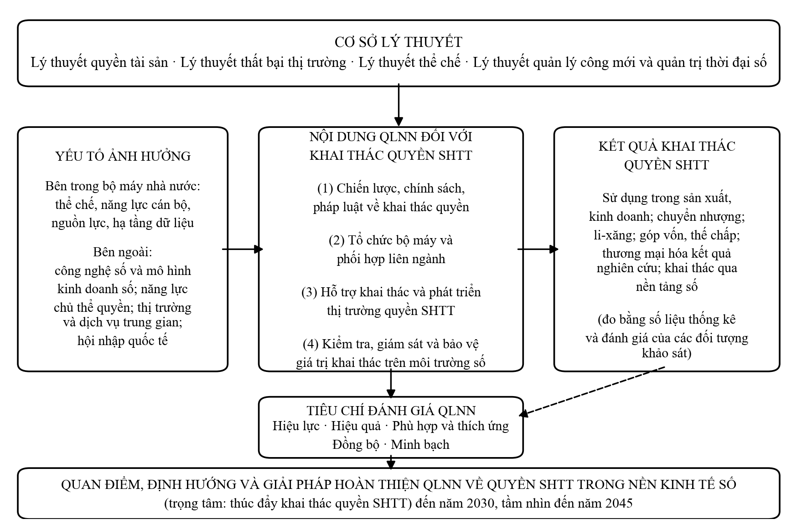
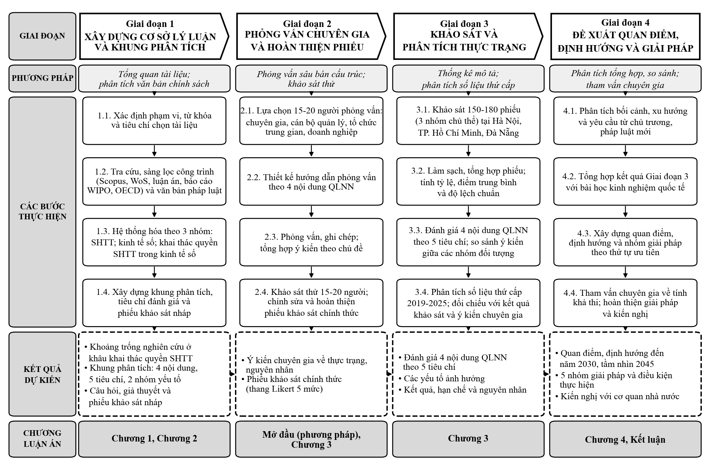

# ĐỀ CƯƠNG CHI TIẾT LUẬN ÁN TIẾN SĨ · Chuyên ngành: Quản lý kinh tế
# TÊN ĐỀ TÀI · QUẢN LÝ NHÀ NƯỚC VỀ QUYỀN SỞ HỮU TRÍ TUỆ · TRONG NỀN KINH TẾ SỐ Ở VIỆT NAM

*Phạm vi giới hạn: Luận án nghiên cứu quản lý nhà nước về quyền sở hữu trí tuệ trong nền kinh tế số, tiếp cận từ và tập trung vào hoạt động khai thác quyền sở hữu trí tuệ.*

## PHẦN MỞ ĐẦU

### 1. Tính cấp thiết của đề tài

Trong nền kinh tế số, tài sản vô hình ngày càng giữ vị trí trung tâm trong quá trình tạo ra giá trị của doanh nghiệp và của nền kinh tế. Quyền sở hữu trí tuệ (SHTT) là hình thức pháp lý để các kết quả sáng tạo trở thành tài sản có thể được sở hữu, định giá và giao dịch. Mặc dù vậy, giá trị kinh tế của quyền SHTT chỉ được hiện thực hóa khi quyền được khai thác, thông qua việc chủ thể quyền trực tiếp sử dụng đối tượng được bảo hộ trong sản xuất, kinh doanh, chuyển nhượng quyền, chuyển quyền sử dụng, góp vốn, thế chấp hoặc thương mại hóa trên thị trường. Xác lập và bảo vệ quyền là điều kiện cần, còn khai thác là khâu chuyển hóa quyền SHTT thành nguồn lực cho tăng trưởng. Sự phát triển của kinh tế số làm thay đổi đáng kể phương thức khai thác: chương trình máy tính và nội dung số được cấp phép, phân phối qua nền tảng trực tuyến; nhãn hiệu gắn với hoạt động kinh doanh trên sàn thương mại điện tử; sáng chế trong lĩnh vực công nghệ số được chuyển giao, li-xăng và kết hợp với dữ liệu để hình thành sản phẩm, dịch vụ mới. Những thay đổi này đặt ra yêu cầu mới đối với vai trò của Nhà nước trong tạo lập khuôn khổ pháp lý, hạ tầng thị trường và cơ chế hỗ trợ cho hoạt động khai thác quyền SHTT.

Trọng tâm chính sách về SHTT ở Việt Nam đang thay đổi rõ nét theo hướng này. Nghị quyết số 57-NQ/TW ngày 22/12/2024 của Bộ Chính trị về đột phá phát triển khoa học, công nghệ, đổi mới sáng tạo và chuyển đổi số quốc gia xác định đây là động lực chính để phát triển lực lượng sản xuất hiện đại [1]. Luật Khoa học, công nghệ và đổi mới sáng tạo số 93/2025/QH15 mở rộng quyền sở hữu và quyền tự chủ của tổ chức chủ trì đối với kết quả nghiên cứu, tạo điều kiện cho thương mại hóa [5]. Luật sửa đổi, bổ sung một số điều của Luật Sở hữu trí tuệ số 131/2025/QH15, có hiệu lực từ ngày 01/4/2026, lần đầu tiên bổ sung một điều luật riêng (Điều 8a) về quản lý, khai thác quyền SHTT, theo đó tài sản trí tuệ có thể được định giá, giao dịch, ghi nhận trong báo cáo tài chính, sử dụng để góp vốn và làm tài sản bảo đảm [6]. Kết luận số 51-KL/TW ngày 17/6/2026 của Bộ Chính trị về đẩy mạnh công tác sở hữu trí tuệ phục vụ phát triển kinh tế - xã hội trong tình hình mới yêu cầu hoàn thiện cơ chế định giá quyền SHTT, xây dựng thị trường công nghệ hiện đại, đẩy mạnh khai thác quyền SHTT như một loại tài sản trong huy động vốn, đầu tư, góp vốn, đồng thời chuyển mạnh từ tư duy quản lý hành chính sang kiến tạo hệ sinh thái SHTT [2]. Cụ thể hóa các yêu cầu đó, Quyết định số 1624/QĐ-TTg ngày 21/8/2026 của Thủ tướng Chính phủ sửa đổi, bổ sung Chiến lược sở hữu trí tuệ đến năm 2030 đã bổ sung mục tiêu thúc đẩy giao dịch quyền SHTT trên thị trường, trong đó có nhiệm vụ thí điểm hỗ trợ xác định giá trị của ít nhất 100 quyền SHTT của viện nghiên cứu, cơ sở giáo dục đại học và doanh nghiệp khởi nghiệp sáng tạo [10]. Cùng với Luật Chuyển đổi số số 148/2025/QH15 [7], các văn bản trên cho thấy khai thác quyền SHTT trong môi trường số đã trở thành một nội dung trọng tâm của quản lý nhà nước (QLNN) về SHTT.

Trên thực tế, khoảng cách giữa số lượng quyền SHTT được xác lập và mức độ khai thác vẫn là một hạn chế của hệ thống SHTT Việt Nam. Việc Kết luận số 51-KL/TW và Quyết định số 1624/QĐ-TTg đặt ra yêu cầu hoàn thiện cơ chế định giá, phát triển thị trường và thúc đẩy giao dịch quyền SHTT phản ánh rằng các điều kiện thể chế và thị trường cho hoạt động khai thác chưa được hình thành đầy đủ. Các quy định về định giá, hạch toán, góp vốn và thế chấp bằng quyền SHTT đang trong quá trình được hướng dẫn chi tiết; thị trường quyền SHTT và mạng lưới dịch vụ trung gian (định giá, môi giới, tư vấn chuyển giao) còn mỏng; kết quả nghiên cứu hình thành từ ngân sách nhà nước chậm được thương mại hóa. Trên môi trường số, nguy cơ xâm phạm quyền với tính chất ẩn danh, xuyên biên giới làm giảm giá trị và động lực khai thác của chủ thể quyền. Luận án sẽ làm rõ các hạn chế này bằng số liệu thống kê của cơ quan quản lý giai đoạn 2019-2025, kết quả khảo sát và ý kiến chuyên gia.

Về phương diện lý luận, tổng quan các công trình trong và ngoài nước cho thấy phần lớn nghiên cứu về QLNN đối với quyền SHTT tập trung vào khâu xác lập, bảo hộ và xử lý vi phạm. Hoạt động khai thác quyền SHTT được nghiên cứu chủ yếu dưới góc độ luật học (hợp đồng chuyển giao, li-xăng) hoặc quản trị doanh nghiệp (chiến lược tài sản trí tuệ, định giá), và phần lớn dựa trên kinh nghiệm của các nền kinh tế phát triển. Các nghiên cứu hiện có chưa làm rõ đầy đủ QLNN đối với khai thác quyền SHTT như một đối tượng quản lý có nội dung, tiêu chí đánh giá và yếu tố ảnh hưởng riêng; đồng thời còn thiếu các đánh giá dựa trên dữ liệu khảo sát về QLNN đối với khai thác quyền SHTT trong điều kiện kinh tế số ở Việt Nam.

Từ những yêu cầu trên, luận án giữ nguyên tên đề tài, đồng thời giới hạn nội dung nghiên cứu vào QLNN đối với hoạt động khai thác quyền SHTT. Cách giới hạn này dựa trên hai căn cứ. Thứ nhất, trong chu trình xác lập, khai thác và bảo vệ quyền, khai thác là khâu trực tiếp tạo ra giá trị kinh tế, phù hợp với cách tiếp cận của chuyên ngành Quản lý kinh tế. Thứ hai, đây là khâu được các chủ trương, pháp luật ban hành giai đoạn 2025-2026 đặt trọng tâm. Hoạt động xác lập và bảo vệ quyền vẫn được xem xét, nhưng ở mức độ là tiền đề và điều kiện bảo đảm cho hoạt động khai thác. Xuất phát từ những yêu cầu lý luận và thực tiễn đó, nghiên cứu sinh lựa chọn đề tài Quản lý nhà nước về quyền sở hữu trí tuệ trong nền kinh tế số ở Việt Nam làm đề tài luận án tiến sĩ chuyên ngành Quản lý kinh tế. Kết quả nghiên cứu góp phần cung cấp luận cứ khoa học cho việc tổ chức thực hiện Luật Sở hữu trí tuệ sửa đổi năm 2025, Kết luận số 51-KL/TW và Chiến lược sở hữu trí tuệ đến năm 2030 đã được sửa đổi, bổ sung.

### 2. Mục đích nghiên cứu

Trên cơ sở làm rõ cơ sở lý luận và đánh giá thực trạng QLNN đối với hoạt động khai thác quyền SHTT trong nền kinh tế số ở Việt Nam giai đoạn 2019-2025, luận án đề xuất quan điểm, định hướng và giải pháp hoàn thiện QLNN về quyền SHTT trong nền kinh tế số theo hướng thúc đẩy khai thác quyền SHTT, đến năm 2030, tầm nhìn đến năm 2045.

### 3. Đối tượng nghiên cứu

Đối tượng nghiên cứu của luận án là QLNN về quyền SHTT trong nền kinh tế số ở Việt Nam, được giới hạn ở QLNN đối với hoạt động khai thác quyền SHTT. Luận án tiếp cận dưới góc độ quản lý kinh tế, tập trung vào hệ thống công cụ và hoạt động của Nhà nước; không đi sâu vào quản trị tài sản trí tuệ nội bộ của doanh nghiệp.

Đối tượng khảo sát gồm bốn nhóm: (i) doanh nghiệp và chủ sở hữu quyền SHTT hoạt động trong các lĩnh vực có mức độ số hóa cao; (ii) cán bộ các cơ quan QLNN có liên quan đến khai thác quyền SHTT ở trung ương và địa phương; (iii) luật sư và đại diện các tổ chức trung gian (tổ chức đại diện sở hữu công nghiệp, tổ chức thẩm định giá, sàn giao dịch công nghệ); (iv) nhà khoa học tại các viện nghiên cứu, trường đại học. Đối tượng phỏng vấn sâu là các chuyên gia đầu ngành và cán bộ quản lý có kinh nghiệm trong lĩnh vực SHTT.

### 4. Nhiệm vụ nghiên cứu

Thứ nhất, tổng quan các công trình nghiên cứu trong và ngoài nước liên quan đến đề tài, xác định những vấn đề đã được giải quyết, những vấn đề còn bỏ ngỏ và những vấn đề đặt ra cần tiếp tục nghiên cứu.

Thứ hai, hệ thống hóa và làm rõ cơ sở lý luận về khai thác quyền SHTT và QLNN đối với khai thác quyền SHTT trong nền kinh tế số (khái niệm, đặc điểm, mục tiêu, nội dung, tiêu chí đánh giá, các yếu tố ảnh hưởng); xây dựng khung phân tích của luận án.

Thứ ba, nghiên cứu kinh nghiệm QLNN đối với khai thác quyền SHTT trong nền kinh tế số của một số quốc gia và rút ra bài học tham khảo cho Việt Nam.

Thứ tư, phân tích, đánh giá thực trạng khai thác quyền SHTT và QLNN đối với khai thác quyền SHTT trong nền kinh tế số ở Việt Nam giai đoạn 2019-2025 theo bốn nội dung và năm tiêu chí; chỉ ra kết quả đạt được, hạn chế và nguyên nhân.

Thứ năm, đề xuất quan điểm, định hướng, giải pháp và kiến nghị hoàn thiện QLNN về quyền SHTT trong nền kinh tế số ở Việt Nam theo hướng thúc đẩy khai thác quyền SHTT đến năm 2030, tầm nhìn đến năm 2045.

### 5. Phạm vi nghiên cứu

#### 5.1. Phạm vi về nội dung

Về hoạt động khai thác quyền SHTT, luận án nghiên cứu các hình thức: (i) chủ thể quyền trực tiếp sử dụng, khai thác thương mại đối tượng được bảo hộ; (ii) chuyển nhượng quyền; (iii) chuyển quyền sử dụng (li-xăng); (iv) góp vốn, thế chấp và huy động vốn bằng quyền SHTT; (v) thương mại hóa kết quả nghiên cứu hình thành quyền SHTT; (vi) khai thác quyền thông qua nền tảng số. Định giá và hạch toán quyền SHTT được xem xét như điều kiện của các giao dịch nói trên.

Về đối tượng quyền, luận án tập trung vào nhóm có liên hệ trực tiếp với kinh tế số: sáng chế và giải pháp hữu ích; nhãn hiệu; quyền tác giả đối với chương trình máy tính và nội dung số. Bí mật kinh doanh, dữ liệu và sản phẩm do trí tuệ nhân tạo tạo ra được đề cập như những vấn đề mới đặt ra đối với QLNN. Quyền đối với giống cây trồng, chỉ dẫn địa lý và quyền liên quan không thuộc phạm vi nghiên cứu sâu.

Về nội dung QLNN, luận án nghiên cứu bốn nội dung: (1) xây dựng và ban hành chiến lược, chính sách, pháp luật về khai thác quyền SHTT; (2) tổ chức bộ máy và phối hợp liên ngành trong QLNN đối với khai thác quyền SHTT; (3) tổ chức thực hiện chính sách hỗ trợ khai thác và phát triển thị trường quyền SHTT (hạ tầng dữ liệu, sàn giao dịch, dịch vụ định giá, môi giới, cơ chế tài chính, tín dụng, nâng cao năng lực chủ thể); (4) kiểm tra, giám sát hoạt động khai thác và bảo vệ giá trị khai thác quyền SHTT trên môi trường số. Hoạt động QLNN được đánh giá theo năm tiêu chí: hiệu lực; hiệu quả; phù hợp và khả năng thích ứng; đồng bộ; minh bạch.

#### 5.2. Phạm vi về chủ thể quản lý

Luận án tập trung vào hoạt động quản lý của Chính phủ, Bộ Khoa học và Công nghệ và các bộ, ngành có liên quan (Bộ Văn hóa, Thể thao và Du lịch, Bộ Công Thương, Bộ Tài chính, Ngân hàng Nhà nước Việt Nam) ở cấp trung ương. Hoạt động quản lý ở địa phương được xem xét thông qua khảo sát tại Hà Nội, Thành phố Hồ Chí Minh và Đà Nẵng; luận án không đi sâu vào các chính sách đặc thù của từng địa phương.

#### 5.3. Phạm vi về thời gian

Dữ liệu thứ cấp được sử dụng để phân tích thực trạng giai đoạn 2019-2025, bắt đầu từ năm ban hành Chiến lược sở hữu trí tuệ đến năm 2030 (Quyết định số 1068/QĐ-TTg) [8]; các văn bản chính sách ban hành năm 2026 được cập nhật khi phân tích bối cảnh và đề xuất giải pháp. Dữ liệu sơ cấp được thu thập trong thời gian thực hiện luận án. Quan điểm, định hướng và giải pháp được đề xuất đến năm 2030, tầm nhìn đến năm 2045.

#### 5.4. Phạm vi về không gian

Luận án nghiên cứu thực trạng trên phạm vi cả nước; khảo sát sơ cấp tại Hà Nội, Thành phố Hồ Chí Minh và Đà Nẵng. Kinh nghiệm quốc tế được nghiên cứu ở Hàn Quốc, Trung Quốc và Singapore, là các quốc gia có chính sách thúc đẩy giao dịch và tài chính hóa tài sản trí tuệ gắn với phát triển kinh tế số.

### 6. Cách tiếp cận và phương pháp nghiên cứu

#### 6.1. Cơ sở phương pháp luận và cách tiếp cận

Luận án dựa trên phương pháp luận duy vật biện chứng và duy vật lịch sử, kết hợp các cách tiếp cận sau. Tiếp cận hệ thống được sử dụng để xem xét QLNN đối với khai thác quyền SHTT như một hệ thống gồm chủ thể, đối tượng, công cụ và môi trường quản lý. Tiếp cận theo chức năng quản lý được sử dụng để phân tích bốn nội dung QLNN từ hoạch định đến tổ chức thực hiện và kiểm tra, giám sát. Tiếp cận theo chu trình của quyền SHTT (xác lập, khai thác, bảo vệ) được sử dụng để định vị khâu khai thác và làm rõ mối liên hệ của khâu này với hai khâu còn lại. Tiếp cận thể chế và tiếp cận liên ngành kinh tế và luật học được sử dụng để phân tích các quy định pháp lý dưới góc độ tác động kinh tế của chúng.

#### 6.2. Cơ sở lý thuyết

Lý thuyết quyền tài sản, với công trình Toward a Theory of Property Rights của Demsetz (1967) [13], giải thích quyền SHTT như một cơ chế nội hóa lợi ích từ hoạt động sáng tạo, qua đó làm rõ bản chất tài sản của quyền và cơ sở kinh tế của việc khai thác. Lý thuyết thất bại thị trường, xuất phát từ phân tích của Arrow (1962) trong Economic Welfare and the Allocation of Resources for Invention [12] về tính khó chiếm hữu và thông tin bất cân xứng của tri thức, cùng với phân tích về thị trường công nghệ trong Markets for Technology: The Economics of Innovation and Corporate Strategy của Arora, Fosfuri và Gambardella (2001) [11], lý giải vì sao giao dịch quyền SHTT có chi phí cao và cần sự can thiệp của Nhà nước vào định giá, thông tin và dịch vụ trung gian. Lý thuyết thể chế, với Institutions, Institutional Change and Economic Performance của North (1990) [17], cung cấp cơ sở phân tích vai trò của quy định pháp lý trong giảm chi phí giao dịch và rủi ro của các giao dịch quyền SHTT. Lý thuyết quản lý công mới (Hood, 1991) [16] và quản trị thời đại số (Dunleavy và cộng sự, 2006) [14] được vận dụng để phân tích sự thay đổi phương thức quản lý từ kiểm soát hành chính sang kiến tạo thị trường, cung cấp dịch vụ công và dữ liệu trên nền tảng số.

#### 6.3. Khung phân tích của luận án

Trên cơ sở các lý thuyết nêu trên, luận án xây dựng khung phân tích gồm năm thành tố: các yếu tố ảnh hưởng; bốn nội dung QLNN đối với khai thác quyền SHTT; kết quả khai thác quyền SHTT; tiêu chí đánh giá QLNN; và quan điểm, định hướng, giải pháp hoàn thiện (Hình 1).

**Hình 1. Khung phân tích của luận án**  
*Nguồn: Nghiên cứu sinh đề xuất*

#### 6.4. Phương pháp thu thập dữ liệu

Dữ liệu thứ cấp gồm: văn bản chủ trương, pháp luật, chiến lược, đề án về SHTT, khoa học và công nghệ, chuyển đổi số và kinh tế số [3], [4], [8], [9]; báo cáo thường niên và số liệu thống kê của Cục Sở hữu trí tuệ, Bộ Khoa học và Công nghệ, Cục Bản quyền tác giả, Tổng cục Thống kê; báo cáo của Tổ chức Sở hữu trí tuệ Thế giới (WIPO), Tổ chức Hợp tác và Phát triển Kinh tế (OECD); sách, luận án, đề tài và bài báo khoa học trong và ngoài nước. Các chỉ tiêu thứ cấp chính gồm số văn bằng bảo hộ còn hiệu lực, số hợp đồng chuyển nhượng và chuyển quyền sử dụng quyền sở hữu công nghiệp được đăng ký, số hợp đồng chuyển giao công nghệ, số giao dịch trên các sàn giao dịch công nghệ và số liệu về thương mại hóa kết quả nghiên cứu.

Dữ liệu sơ cấp được thu thập bằng hai phương pháp. Thứ nhất, khảo sát bằng bảng hỏi với quy mô dự kiến khoảng 100 phiếu (Bảng 1), sử dụng thang đo Likert 5 mức (từ 1: hoàn toàn không đồng ý đến 5: hoàn toàn đồng ý). Bảng hỏi gồm các nhận định đánh giá bốn nội dung QLNN đối với khai thác quyền SHTT theo năm tiêu chí, tình hình khai thác quyền SHTT của đơn vị và các yếu tố ảnh hưởng. Mẫu được chọn theo phương pháp thuận tiện tại Hà Nội, Thành phố Hồ Chí Minh và Đà Nẵng; quy mô mẫu tham khảo quy tắc tối thiểu 100 quan sát và năm quan sát cho mỗi nhận định của Hair và cộng sự (2014) [15]. Thứ hai, phỏng vấn sâu bán cấu trúc khoảng 10 chuyên gia đầu ngành, cán bộ lãnh đạo, quản lý của Cục Sở hữu trí tuệ, Bộ Khoa học và Công nghệ và các nhà khoa học, nhằm làm rõ nguyên nhân của những hạn chế và thảo luận tính khả thi của giải pháp.

**Bảng 1. Cơ cấu mẫu khảo sát dự kiến**

| Nhóm đối tượng | Số phiếu dự kiến | Nội dung khảo sát chính |
|---|---|---|
| Doanh nghiệp, chủ sở hữu quyền SHTT | 50 | Đánh giá bốn nội dung QLNN theo năm tiêu chí; tình hình khai thác quyền SHTT của đơn vị; khó khăn khi thực hiện giao dịch |
| Cán bộ QLNN (Cục Sở hữu trí tuệ, Bộ Khoa học và Công nghệ, Cục Bản quyền tác giả, Sở Khoa học và Công nghệ) | 25 | Đánh giá bốn nội dung QLNN theo năm tiêu chí; điều kiện bảo đảm và các yếu tố ảnh hưởng |
| Luật sư, tổ chức đại diện sở hữu công nghiệp, tổ chức thẩm định giá, sàn giao dịch công nghệ | 15 | Đánh giá khung pháp lý giao dịch, dịch vụ định giá, môi giới và thị trường quyền SHTT |
| Nhà khoa học tại viện nghiên cứu, trường đại học | 10 | Đánh giá chính sách thương mại hóa kết quả nghiên cứu và phân chia lợi ích |
| Tổng cộng | 100 |  |

*Nguồn: Nghiên cứu sinh dự kiến*

#### 6.5. Phương pháp phân tích dữ liệu

Dữ liệu khảo sát được tổng hợp và xử lý bằng Excel và SPSS theo phương pháp thống kê mô tả: tần suất, tỷ lệ, điểm trung bình và độ lệch chuẩn. Điểm trung bình được diễn giải theo năm mức với khoảng cách 0,8: từ 1,00 đến 1,80 là rất thấp; từ 1,81 đến 2,60 là thấp; từ 2,61 đến 3,40 là trung bình; từ 3,41 đến 4,20 là khá; từ 4,21 đến 5,00 là cao. Kết quả được so sánh giữa các nhóm đối tượng khảo sát để nhận diện những khác biệt trong đánh giá. Dữ liệu phỏng vấn được tổng hợp, phân loại theo chủ đề và dùng để giải thích, đối chiếu với kết quả khảo sát. Bên cạnh đó, luận án sử dụng phương pháp phân tích và tổng hợp để hệ thống hóa cơ sở lý luận; phương pháp so sánh để đối chiếu số liệu qua các năm và kinh nghiệm của các quốc gia; phương pháp thống kê, bảng, biểu đồ để trình bày thực trạng.

#### 6.6. Quy trình nghiên cứu

Luận án được thực hiện theo bốn giai đoạn nối tiếp nhau, kết quả của giai đoạn trước là đầu vào của giai đoạn sau (Hình 2). Giai đoạn 1 sử dụng phương pháp tổng quan tài liệu và phân tích văn bản chính sách để xác định khoảng trống nghiên cứu, xây dựng khung phân tích, tiêu chí đánh giá và phiếu khảo sát nháp; kết quả được trình bày ở Chương 1 và Chương 2. Giai đoạn 2 thực hiện phỏng vấn khoảng 10 chuyên gia và khảo sát thử để hoàn thiện phiếu khảo sát. Giai đoạn 3 tiến hành khảo sát khoảng 100 phiếu, tính điểm trung bình và độ lệch chuẩn, đánh giá bốn nội dung QLNN theo năm tiêu chí và đối chiếu với số liệu thứ cấp giai đoạn 2019-2025; kết quả được trình bày ở Chương 3. Giai đoạn 4 tổng hợp kết quả nghiên cứu với bài học kinh nghiệm quốc tế, đề xuất quan điểm, định hướng và giải pháp, sau đó tham vấn chuyên gia về tính khả thi trước khi hoàn thiện Chương 4.

**Hình 2. Quy trình thực hiện nghiên cứu**  
*Nguồn: Nghiên cứu sinh đề xuất*

### 7. Câu hỏi và giả thuyết nghiên cứu

#### 7.1. Câu hỏi nghiên cứu

Câu hỏi 1: QLNN đối với khai thác quyền SHTT trong nền kinh tế số gồm những nội dung nào, được đánh giá theo những tiêu chí nào và chịu ảnh hưởng của những yếu tố nào?

Câu hỏi 2: Thực trạng QLNN đối với khai thác quyền SHTT trong nền kinh tế số ở Việt Nam giai đoạn 2019-2025 như thế nào; đạt được kết quả gì, còn hạn chế gì và do những nguyên nhân nào?

Câu hỏi 3: Cần những giải pháp nào để hoàn thiện QLNN về quyền SHTT trong nền kinh tế số ở Việt Nam theo hướng thúc đẩy khai thác quyền SHTT đến năm 2030, tầm nhìn đến năm 2045?

#### 7.2. Giả thuyết nghiên cứu

Giả thuyết 1: QLNN đối với khai thác quyền SHTT trong nền kinh tế số là một bộ phận của QLNN về quyền SHTT, có nội dung riêng gồm hoạch định chính sách, pháp luật; tổ chức bộ máy và phối hợp; hỗ trợ khai thác và phát triển thị trường; kiểm tra, giám sát; và có thể được đánh giá theo năm tiêu chí hiệu lực, hiệu quả, phù hợp và khả năng thích ứng, đồng bộ, minh bạch.

Giả thuyết 2: QLNN đối với khai thác quyền SHTT ở Việt Nam giai đoạn 2019-2025 còn tập trung vào xác lập và bảo vệ quyền; các quy định về định giá, góp vốn, thế chấp chưa đồng bộ, thị trường quyền SHTT và dịch vụ trung gian chưa phát triển, phối hợp liên ngành còn hạn chế, dẫn đến kết quả khai thác quyền SHTT chưa tương xứng với số lượng quyền được xác lập.

Giả thuyết 3: Nếu Nhà nước hoàn thiện thể chế giao dịch quyền SHTT, phát triển thị trường và hạ tầng hỗ trợ khai thác trên nền tảng số, đồng thời nâng cao năng lực của doanh nghiệp và chủ thể quyền, thì hoạt động khai thác quyền SHTT trong nền kinh tế số sẽ được thúc đẩy.

Các giả thuyết được kiểm chứng thông qua phân tích lý luận, số liệu thứ cấp, kết quả khảo sát và ý kiến chuyên gia.

### 8. Những đóng góp mới dự kiến của luận án

#### 8.1. Về lý luận

Thứ nhất, làm rõ khái niệm, đặc điểm, mục tiêu của QLNN đối với khai thác quyền SHTT trong nền kinh tế số, xem khai thác quyền như một đối tượng QLNN có nội dung riêng, phân biệt với QLNN đối với xác lập và bảo vệ quyền.

Thứ hai, xây dựng khung phân tích QLNN đối với khai thác quyền SHTT trong nền kinh tế số gồm bốn nội dung quản lý, năm tiêu chí đánh giá, hai nhóm yếu tố ảnh hưởng và hệ thống chỉ tiêu phản ánh kết quả khai thác.

Thứ ba, cụ thể hóa hệ thống chỉ tiêu phản ánh kết quả khai thác quyền SHTT làm căn cứ đánh giá QLNN trong điều kiện kinh tế số.

#### 8.2. Về thực tiễn

Thứ nhất, cung cấp bức tranh tương đối toàn diện về thực trạng khai thác quyền SHTT và QLNN đối với khai thác quyền SHTT trong nền kinh tế số ở Việt Nam giai đoạn 2019-2025, bao gồm giai đoạn chuyển tiếp chính sách với Luật Sở hữu trí tuệ sửa đổi năm 2025, Kết luận số 51-KL/TW và Quyết định số 1624/QĐ-TTg.

Thứ hai, đánh giá QLNN đối với khai thác quyền SHTT theo năm tiêu chí dựa trên kết quả khảo sát và ý kiến chuyên gia, chỉ ra những nội dung quản lý còn hạn chế làm cơ sở xác định thứ tự ưu tiên của các giải pháp.

Thứ ba, đề xuất hệ thống giải pháp và kiến nghị hoàn thiện QLNN về quyền SHTT trong nền kinh tế số theo hướng thúc đẩy khai thác quyền SHTT đến năm 2030, tầm nhìn đến năm 2045; kết quả nghiên cứu có thể sử dụng làm tài liệu tham khảo cho cơ quan quản lý, cơ sở nghiên cứu, đào tạo và doanh nghiệp.

### 9. Kết cấu của luận án

Ngoài phần mở đầu, kết luận, danh mục chữ viết tắt, danh mục bảng, hình, danh mục công trình đã công bố, tài liệu tham khảo và phụ lục, nội dung chính của luận án được kết cấu thành 04 chương:

Chương 1. Tổng quan tình hình nghiên cứu và những vấn đề đặt ra cần nghiên cứu của đề tài luận án.

Chương 2. Cơ sở lý luận và kinh nghiệm thực tiễn về quản lý nhà nước về quyền sở hữu trí tuệ trong nền kinh tế số.

Chương 3. Thực trạng quản lý nhà nước về quyền sở hữu trí tuệ trong nền kinh tế số ở Việt Nam giai đoạn 2019-2025.

Chương 4. Quan điểm, định hướng và giải pháp hoàn thiện quản lý nhà nước về quyền sở hữu trí tuệ trong nền kinh tế số ở Việt Nam đến năm 2030, tầm nhìn đến năm 2045.

## DỰ KIẾN KẾT CẤU CHI TIẾT CỦA LUẬN ÁN

## CHƯƠNG 1. TỔNG QUAN TÌNH HÌNH NGHIÊN CỨU VÀ NHỮNG VẤN ĐỀ ĐẶT RA CẦN NGHIÊN CỨU CỦA ĐỀ TÀI LUẬN ÁN

*Mục đích: hệ thống hóa các công trình theo ba nhóm, làm rõ vấn đề đã thống nhất, vấn đề còn tranh luận và khoảng trống ở khâu khai thác quyền SHTT; trình bày khung phân tích và phương pháp nghiên cứu.*

### 1.1. Tổng quan tình hình nghiên cứu liên quan đến đề tài luận án

#### 1.1.1. Những công trình nghiên cứu về quyền sở hữu trí tuệ

*1.1.1.1. Các công trình nghiên cứu của nước ngoài*

*1.1.1.2. Các công trình nghiên cứu trong nước*

#### 1.1.2. Những công trình nghiên cứu về nền kinh tế số

*1.1.2.1. Các công trình nghiên cứu của nước ngoài*

*1.1.2.2. Các công trình nghiên cứu trong nước*

#### 1.1.3. Những công trình nghiên cứu về khai thác quyền sở hữu trí tuệ trong nền kinh tế số

*1.1.3.1. Các công trình nghiên cứu của nước ngoài*

*1.1.3.2. Các công trình nghiên cứu trong nước*

### 1.2. Nhận xét tình hình nghiên cứu liên quan đến đề tài luận án

#### 1.2.1. Nhận xét tổng quát

#### 1.2.2. Những vấn đề đã đạt được sự thống nhất trong nghiên cứu liên quan đến đề tài luận án

#### 1.2.3. Những vấn đề còn tranh luận, chưa rõ hoặc chưa được tiếp cận nghiên cứu liên quan đến đề tài luận án

### 1.3. Những vấn đề đặt ra cần tiếp tục nghiên cứu của đề tài luận án

#### 1.3.1. Những vấn đề về lý luận

#### 1.3.2. Những vấn đề về thực trạng

#### 1.3.3. Những vấn đề về giải pháp

### 1.4. Khung phân tích và phương pháp nghiên cứu của luận án

#### 1.4.1. Cách tiếp cận, khung phân tích và quy trình nghiên cứu

#### 1.4.2. Phương pháp thu thập dữ liệu

#### 1.4.3. Phương pháp phân tích dữ liệu

Kết luận Chương 1

## CHƯƠNG 2. CƠ SỞ LÝ LUẬN VÀ KINH NGHIỆM THỰC TIỄN VỀ QUẢN LÝ NHÀ NƯỚC VỀ QUYỀN SỞ HỮU TRÍ TUỆ TRONG NỀN KINH TẾ SỐ

*Mục đích: xác lập cơ sở lý luận về QLNN đối với khai thác quyền SHTT trong nền kinh tế số và rút ra bài học từ kinh nghiệm quốc tế.*

### 2.1. Quyền sở hữu trí tuệ và khai thác quyền sở hữu trí tuệ trong nền kinh tế số

#### 2.1.1. Khái niệm, đặc điểm của quyền sở hữu trí tuệ và các đối tượng quyền sở hữu trí tuệ trong nền kinh tế số

#### 2.1.2. Nền kinh tế số và những thay đổi đối với phương thức khai thác quyền sở hữu trí tuệ

#### 2.1.3. Khái niệm, các hình thức và chỉ tiêu phản ánh kết quả khai thác quyền sở hữu trí tuệ

### 2.2. Các lý thuyết nền tảng

#### 2.2.1. Lý thuyết quyền tài sản

#### 2.2.2. Lý thuyết thất bại thị trường

#### 2.2.3. Lý thuyết thể chế

#### 2.2.4. Lý thuyết quản lý công mới và quản trị thời đại số

### 2.3. Khái niệm, đặc điểm, mục tiêu và vai trò của quản lý nhà nước đối với khai thác quyền sở hữu trí tuệ trong nền kinh tế số

#### 2.3.1. Khái niệm quản lý nhà nước đối với khai thác quyền sở hữu trí tuệ trong nền kinh tế số

#### 2.3.2. Đặc điểm của quản lý nhà nước đối với khai thác quyền sở hữu trí tuệ trong nền kinh tế số

#### 2.3.3. Mục tiêu và vai trò của quản lý nhà nước đối với khai thác quyền sở hữu trí tuệ trong nền kinh tế số

### 2.4. Nội dung quản lý nhà nước đối với khai thác quyền sở hữu trí tuệ trong nền kinh tế số

#### 2.4.1. Xây dựng và ban hành chiến lược, chính sách, pháp luật về khai thác quyền sở hữu trí tuệ

#### 2.4.2. Tổ chức bộ máy và phối hợp liên ngành trong quản lý nhà nước đối với khai thác quyền sở hữu trí tuệ

#### 2.4.3. Tổ chức thực hiện chính sách hỗ trợ khai thác và phát triển thị trường quyền sở hữu trí tuệ

#### 2.4.4. Kiểm tra, giám sát hoạt động khai thác và bảo vệ giá trị khai thác quyền sở hữu trí tuệ trên môi trường số

### 2.5. Tiêu chí đánh giá quản lý nhà nước đối với khai thác quyền sở hữu trí tuệ trong nền kinh tế số

#### 2.5.1. Tiêu chí hiệu lực và hiệu quả

#### 2.5.2. Tiêu chí phù hợp và khả năng thích ứng

#### 2.5.3. Tiêu chí đồng bộ và minh bạch

### 2.6. Các yếu tố ảnh hưởng đến quản lý nhà nước đối với khai thác quyền sở hữu trí tuệ trong nền kinh tế số

#### 2.6.1. Nhóm yếu tố bên trong bộ máy quản lý nhà nước

#### 2.6.2. Nhóm yếu tố bên ngoài

### 2.7. Kinh nghiệm quốc tế và bài học cho Việt Nam

#### 2.7.1. Kinh nghiệm của Hàn Quốc

#### 2.7.2. Kinh nghiệm của Trung Quốc

#### 2.7.3. Kinh nghiệm của Singapore

#### 2.7.4. Bài học tham khảo cho Việt Nam

Kết luận Chương 2

## CHƯƠNG 3. THỰC TRẠNG QUẢN LÝ NHÀ NƯỚC VỀ QUYỀN SỞ HỮU TRÍ TUỆ TRONG NỀN KINH TẾ SỐ Ở VIỆT NAM GIAI ĐOẠN 2019-2025

*Mục đích: phân tích thực trạng khai thác quyền SHTT và bốn nội dung QLNN; đánh giá theo năm tiêu chí trên cơ sở kết quả khảo sát; phân tích các yếu tố ảnh hưởng; chỉ ra kết quả, hạn chế và nguyên nhân.*

### 3.1. Bối cảnh và thực trạng khai thác quyền sở hữu trí tuệ trong nền kinh tế số ở Việt Nam

#### 3.1.1. Khái quát sự phát triển của nền kinh tế số ở Việt Nam

#### 3.1.2. Thực trạng xác lập quyền sở hữu trí tuệ với tư cách tiền đề cho hoạt động khai thác

#### 3.1.3. Thực trạng các hình thức khai thác quyền sở hữu trí tuệ

### 3.2. Thực trạng nội dung quản lý nhà nước đối với khai thác quyền sở hữu trí tuệ trong nền kinh tế số

#### 3.2.1. Thực trạng xây dựng và ban hành chiến lược, chính sách, pháp luật về khai thác quyền sở hữu trí tuệ

#### 3.2.2. Thực trạng tổ chức bộ máy và phối hợp liên ngành

#### 3.2.3. Thực trạng tổ chức thực hiện chính sách hỗ trợ khai thác và phát triển thị trường quyền sở hữu trí tuệ

#### 3.2.4. Thực trạng kiểm tra, giám sát và bảo vệ giá trị khai thác quyền sở hữu trí tuệ trên môi trường số

### 3.3. Đánh giá quản lý nhà nước đối với khai thác quyền sở hữu trí tuệ theo các tiêu chí

#### 3.3.1. Đánh giá theo tiêu chí hiệu lực và hiệu quả

#### 3.3.2. Đánh giá theo tiêu chí phù hợp và khả năng thích ứng

#### 3.3.3. Đánh giá theo tiêu chí đồng bộ và minh bạch

### 3.4. Thực trạng các yếu tố ảnh hưởng đến quản lý nhà nước đối với khai thác quyền sở hữu trí tuệ

#### 3.4.1. Nhóm yếu tố bên trong bộ máy quản lý nhà nước

#### 3.4.2. Nhóm yếu tố bên ngoài

### 3.5. Đánh giá chung

#### 3.5.1. Những kết quả đạt được

#### 3.5.2. Những hạn chế, bất cập

#### 3.5.3. Nguyên nhân của những hạn chế, bất cập

Kết luận Chương 3

## CHƯƠNG 4. QUAN ĐIỂM, ĐỊNH HƯỚNG VÀ GIẢI PHÁP HOÀN THIỆN QUẢN LÝ NHÀ NƯỚC VỀ QUYỀN SỞ HỮU TRÍ TUỆ TRONG NỀN KINH TẾ SỐ Ở VIỆT NAM ĐẾN NĂM 2030, TẦM NHÌN ĐẾN NĂM 2045

*Mục đích: từ bối cảnh, kết quả chương 3 và bài học kinh nghiệm, đề xuất quan điểm, định hướng, giải pháp tương ứng với bốn nội dung QLNN và các điều kiện bảo đảm.*

### 4.1. Bối cảnh và yêu cầu đặt ra đối với quản lý nhà nước về quyền sở hữu trí tuệ trong nền kinh tế số

#### 4.1.1. Xu hướng quốc tế về khai thác và tài chính hóa tài sản trí tuệ trong nền kinh tế số

#### 4.1.2. Bối cảnh trong nước và yêu cầu từ các chủ trương, pháp luật mới về sở hữu trí tuệ

#### 4.1.3. Cơ hội và thách thức

### 4.2. Quan điểm và định hướng hoàn thiện quản lý nhà nước về quyền sở hữu trí tuệ trong nền kinh tế số

#### 4.2.1. Quan điểm hoàn thiện

#### 4.2.2. Định hướng hoàn thiện đến năm 2030, tầm nhìn đến năm 2045

### 4.3. Giải pháp hoàn thiện quản lý nhà nước về quyền sở hữu trí tuệ trong nền kinh tế số theo hướng thúc đẩy khai thác quyền

#### 4.3.1. Hoàn thiện chính sách, pháp luật về khai thác quyền sở hữu trí tuệ

#### 4.3.2. Kiện toàn tổ chức bộ máy và cơ chế phối hợp liên ngành

#### 4.3.3. Phát triển thị trường quyền sở hữu trí tuệ và hạ tầng, dịch vụ hỗ trợ khai thác trên nền tảng số

#### 4.3.4. Tăng cường kiểm tra, giám sát và bảo vệ giá trị khai thác quyền sở hữu trí tuệ trên môi trường số

#### 4.3.5. Nâng cao năng lực khai thác quyền sở hữu trí tuệ của doanh nghiệp và các chủ thể quyền

### 4.4. Điều kiện thực hiện giải pháp và kiến nghị

#### 4.4.1. Điều kiện thực hiện giải pháp

#### 4.4.2. Kiến nghị đối với Quốc hội, Chính phủ và các bộ, ngành

Kết luận Chương 4

KẾT LUẬN

DANH MỤC CÔNG TRÌNH KHOA HỌC ĐÃ CÔNG BỐ LIÊN QUAN ĐẾN LUẬN ÁN

TÀI LIỆU THAM KHẢO

PHỤ LỤC: Phiếu khảo sát; Hướng dẫn phỏng vấn chuyên gia; Kết quả tổng hợp dữ liệu khảo sát.

## DỰ KIẾN SẢN PHẨM KHOA HỌC

Theo chuẩn đầu ra, nghiên cứu sinh dự kiến công bố 03 bài báo trên tạp chí khoa học trong nước (tính điểm 0,75), 01 bài báo trên tạp chí quốc tế và chủ trì 01 đề tài nghiên cứu cấp cơ sở. Các bài báo trong nước dự kiến gắn với ba nội dung: cơ sở lý luận về QLNN đối với khai thác quyền SHTT trong nền kinh tế số; thực trạng thị trường và cơ chế định giá quyền SHTT ở Việt Nam; kết quả khảo sát đánh giá QLNN đối với khai thác quyền SHTT. Bài báo quốc tế dự kiến so sánh chính sách thúc đẩy khai thác quyền SHTT của Việt Nam với một số quốc gia châu Á. Đề tài cấp cơ sở đã được lựa chọn là Chia sẻ dữ liệu mở và bảo vệ quyền sở hữu trí tuệ: Cân bằng lợi ích hướng tới mô hình quản trị nhà nước dựa trên dữ liệu.

## DANH MỤC VĂN BẢN VÀ TÀI LIỆU VIỆN DẪN TRONG ĐỀ CƯƠNG

#### Tiếng Việt

[1] Bộ Chính trị (2024), Nghị quyết số 57-NQ/TW ngày 22/12/2024 về đột phá phát triển khoa học, công nghệ, đổi mới sáng tạo và chuyển đổi số quốc gia, Hà Nội.

[2] Bộ Chính trị (2026), Kết luận số 51-KL/TW ngày 17/6/2026 về đẩy mạnh công tác sở hữu trí tuệ phục vụ phát triển kinh tế - xã hội trong tình hình mới, Hà Nội.

[3] Quốc hội (2005), Luật Sở hữu trí tuệ số 50/2005/QH11 ngày 29/11/2005, được sửa đổi, bổ sung năm 2009, 2019, 2022 và 2025.

[4] Quốc hội (2025), Luật Công nghiệp công nghệ số số 71/2025/QH15 ngày 14/6/2025.

[5] Quốc hội (2025), Luật Khoa học, công nghệ và đổi mới sáng tạo số 93/2025/QH15 ngày 27/6/2025.

[6] Quốc hội (2025), Luật sửa đổi, bổ sung một số điều của Luật Sở hữu trí tuệ số 131/2025/QH15 ngày 10/12/2025.

[7] Quốc hội (2025), Luật Chuyển đổi số số 148/2025/QH15 ngày 11/12/2025.

[8] Thủ tướng Chính phủ (2019), Quyết định số 1068/QĐ-TTg ngày 22/8/2019 phê duyệt Chiến lược sở hữu trí tuệ đến năm 2030.

[9] Thủ tướng Chính phủ (2022), Quyết định số 411/QĐ-TTg ngày 31/3/2022 phê duyệt Chiến lược quốc gia phát triển kinh tế số và xã hội số đến năm 2025, định hướng đến năm 2030.

[10] Thủ tướng Chính phủ (2026), Quyết định số 1624/QĐ-TTg ngày 21/8/2026 sửa đổi, bổ sung một số điều của Quyết định số 1068/QĐ-TTg ngày 22/8/2019 phê duyệt Chiến lược sở hữu trí tuệ đến năm 2030.

#### Tiếng Anh

[11] Arora A., Fosfuri A., Gambardella A. (2001), Markets for Technology: The Economics of Innovation and Corporate Strategy, MIT Press, Cambridge, MA.

[12] Arrow K.J. (1962), “Economic welfare and the allocation of resources for invention”, in National Bureau of Economic Research, The Rate and Direction of Inventive Activity: Economic and Social Factors, Princeton University Press, Princeton, 609-626.

[13] Demsetz H. (1967), “Toward a theory of property rights”, The American Economic Review, 57(2), 347-359.

[14] Dunleavy P., Margetts H., Bastow S., Tinkler J. (2006), “New public management is dead: Long live digital-era governance”, Journal of Public Administration Research and Theory, 16(3), 467-494.

[15] Hair J.F., Black W.C., Babin B.J., Anderson R.E. (2014), Multivariate Data Analysis (7th ed.), Pearson Education, Harlow.

[16] Hood C. (1991), “A public management for all seasons?”, Public Administration, 69(1), 3-19.

[17] North D.C. (1990), Institutions, Institutional Change and Economic Performance, Cambridge University Press, Cambridge.
