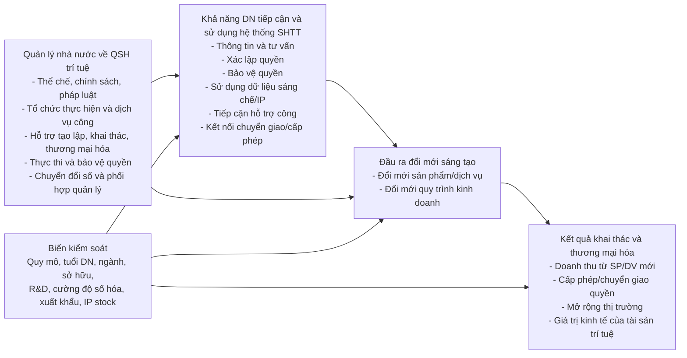
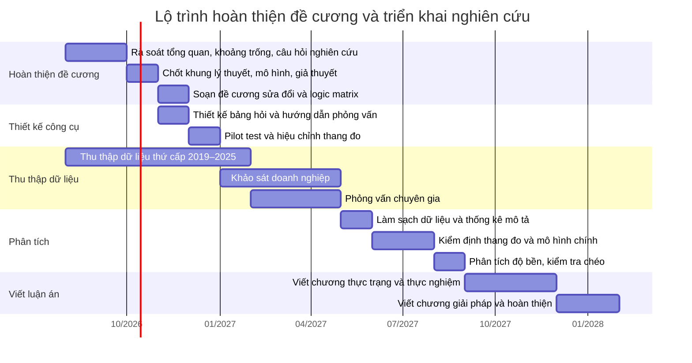

# Đề cương sửa đổi cho luận án về quản lý nhà nước đối với quyền sở hữu trí tuệ trong nền kinh tế số ở Việt Nam

## Tóm tắt điều hành

Bản sửa đổi này đề xuất giữ **tên đề tài ngắn gọn** là **“Quản lý nhà nước về quyền sở hữu trí tuệ trong nền kinh tế số ở Việt Nam”**, nhưng xác định rõ ngay từ câu định vị rằng **“thúc đẩy đổi mới sáng tạo” là trục nghiên cứu xuyên suốt**. Điểm thay đổi quan trọng nhất so với bản đề cương hiện tại là: thay vì chỉ mô tả thực trạng quản lý nhà nước, luận án sẽ được thiết kế thành **hai hợp phần thực nghiệm bổ sung cho nhau**: một hợp phần **đánh giá hệ thống quản lý nhà nước** và một hợp phần **phân tích mối quan hệ và cơ chế ảnh hưởng** từ quản lý nhà nước về quyền sở hữu trí tuệ đến đổi mới sáng tạo doanh nghiệp thông qua **khả năng doanh nghiệp tiếp cận và sử dụng hệ thống sở hữu trí tuệ**. Cách tiếp cận này khắc phục điểm yếu của bản hiện tại vốn còn tập trung vào quyền sở hữu công nghiệp, giai đoạn 2018–2025, mẫu khảo sát khoảng 100 đối tượng và phân tích thống kê mô tả là chính. fileciteturn0file0

Về thời gian, giai đoạn phân tích thực trạng nên chuyển sang **2019–2025** vì 2019 là mốc mở đầu của một chuỗi thay đổi thể chế và chính sách có ý nghĩa trực tiếp với SHTT, đổi mới sáng tạo và kinh tế số: CPTPP có hiệu lực với Việt Nam từ ngày 14/01/2019; Luật số 42/2019/QH14 được ban hành ngày 14/06/2019 và có hiệu lực từ 01/11/2019; Chiến lược SHTT đến năm 2030 được phê duyệt ngày 22/08/2019; Nghị quyết 52-NQ/TW về Cách mạng công nghiệp lần thứ tư ban hành ngày 27/09/2019; tiếp đó là Chương trình Chuyển đổi số quốc gia năm 2020, Chiến lược kinh tế số và xã hội số năm 2022, Luật số 07/2022/QH15 có hiệu lực từ 01/01/2023 và Nghị định 65/2023/NĐ-CP. Vì vậy, 2019 không chỉ là mốc thời gian thuận tiện mà là **mốc khởi đầu khoa học** cho giai đoạn chuyển đổi thể chế liên quan trực tiếp đến chủ đề luận án. citeturn0search0turn1search1turn1search0turn2search0turn1search2turn1search6turn2search1turn0search6

Về lý thuyết, khoảng trống trung tâm nên được phát biểu theo hướng: các nghiên cứu hiện có đã phân tích vai trò của bảo hộ SHTT và thực thi quyền, nhưng **chưa tích hợp được một khung lý thuyết đủ chặt chẽ để giải thích cơ chế mà quản lý nhà nước về SHTT ở cấp độ hệ thống tác động đến đổi mới sáng tạo ở cấp doanh nghiệp thông qua khả năng tiếp cận và sử dụng hệ thống SHTT**, đặc biệt trong bối cảnh kinh tế số. Khung lý thuyết phù hợp nhất là khung tích hợp nhiều tầng giữa **lý thuyết thể chế và hệ thống đổi mới**, **lý thuyết quyền tài sản**, **lý thuyết thất bại thị trường**, cùng với cách tiếp cận **đồng tiến hóa giữa công nghệ và pháp luật** và **quản trị đa chủ thể** trong môi trường số. OECD đã nhấn mạnh vai trò của **hệ thống SHTT quốc gia** đối với mục tiêu đổi mới và phát triển; Oslo Manual 2018 cũng xác lập đổi mới doanh nghiệp theo hai loại chính là **đổi mới sản phẩm** và **đổi mới quy trình kinh doanh**, đồng thời coi các hoạt động liên quan đến SHTT là một phần của hoạt động đổi mới. citeturn16search0turn16search3turn3search0turn3search1turn3search2turn21search2turn22search2

Về thực nghiệm, phần định lượng nên đặt trọng tâm ở **doanh nghiệp** chứ không trộn doanh nghiệp với cán bộ, luật sư và chuyên gia trong cùng một mô hình. Mẫu định lượng mục tiêu nên ở khoảng **250–350 doanh nghiệp**, đủ để chạy **PLS-SEM** hoặc mô hình trung gian bằng hồi quy với các cấu phần bậc thấp và bậc cao, trong khi phần định tính nên gồm **15–20 phỏng vấn chuyên gia** từ cơ quan quản lý, tổ chức trung gian, đại diện sở hữu công nghiệp, luật sư, chuyên gia đổi mới sáng tạo và đại diện doanh nghiệp công nghệ. PLS-SEM thích hợp khi mục tiêu nghiên cứu thiên về dự báo, giải thích cơ chế, chấp nhận mô hình có cấu trúc phân cấp và cần làm việc với dữ liệu khảo sát thực tế của doanh nghiệp; về nguyên tắc đánh giá, các chỉ số như độ tin cậy nội tại, AVE, HTMT, VIF, bootstrapping và dự báo ngoài mẫu đã được hệ thống hóa trong hướng dẫn PLS-SEM của Hair và cộng sự. citeturn23view0turn13search4turn13search6

## Định vị đề cương đã sửa

### Tên đề tài và câu định vị

**Tên đề tài rút gọn đề xuất**

> **Quản lý nhà nước về quyền sở hữu trí tuệ trong nền kinh tế số ở Việt Nam**

**Câu định vị học thuật cần đặt ngay sau tên đề tài**

> Luận án nghiên cứu quản lý nhà nước về quyền sở hữu trí tuệ trong nền kinh tế số ở Việt Nam dưới góc độ quản lý kinh tế, trong đó **thúc đẩy đổi mới sáng tạo** là trục nghiên cứu xuyên suốt và là tiêu chuẩn để đánh giá hiệu lực, hiệu quả và khả năng thích ứng của hoạt động quản lý nhà nước.

Cách định vị này cho phép tên đề tài ngắn, nhưng vẫn giữ nguyên linh hồn khoa học của đề tài ban đầu. Nó cũng phù hợp hơn với bối cảnh chính sách từ 2019 đến nay, khi Việt Nam đồng thời thúc đẩy đổi mới sáng tạo, chuyển đổi số và hoàn thiện thể chế SHTT. citeturn1search1turn1search2turn1search6turn15search3

### Mục tiêu tổng quát, mục tiêu cụ thể, câu hỏi nghiên cứu và khoảng trống lý thuyết trung tâm

**Mục tiêu tổng quát sửa đổi**

Nghiên cứu cơ sở lý luận và thực tiễn về quản lý nhà nước đối với quyền sở hữu trí tuệ trong nền kinh tế số; xây dựng khung phân tích tích hợp về quản lý nhà nước, khả năng doanh nghiệp tiếp cận và sử dụng hệ thống SHTT, và kết quả đổi mới sáng tạo; phân tích thực trạng quản lý nhà nước về quyền sở hữu trí tuệ ở Việt Nam giai đoạn 2019–2025 và làm rõ mối quan hệ, cơ chế ảnh hưởng của hoạt động quản lý này đến đổi mới sáng tạo của doanh nghiệp; từ đó đề xuất định hướng và giải pháp hoàn thiện quản lý nhà nước về quyền sở hữu trí tuệ nhằm hỗ trợ đổi mới sáng tạo và phát triển kinh tế số ở Việt Nam đến năm 2035. citeturn1search1turn1search2turn1search6turn2search1turn0search6turn15search3

**Mục tiêu cụ thể đề xuất**

| Mục tiêu cụ thể | Nội dung cốt lõi |
|---|---|
| Hệ thống hóa cơ sở lý luận | Làm rõ khái niệm, đặc trưng, mục tiêu và vai trò của quản lý nhà nước về SHTT trong nền kinh tế số dưới góc độ quản lý kinh tế |
| Xây dựng khung phân tích tích hợp | Liên kết quản lý nhà nước → tiếp cận/sử dụng hệ thống SHTT → đổi mới sáng tạo → thương mại hóa |
| Phân tích kinh nghiệm quốc tế | Rút bài học từ Singapore, Hàn Quốc và EU về số hóa dịch vụ IP, hỗ trợ doanh nghiệp và thực thi trong môi trường số |
| Đánh giá thực trạng hệ thống quản lý | Phân tích thể chế, tổ chức thực hiện, hỗ trợ khai thác–thương mại hóa, thực thi và chuyển đổi số trong quản lý SHTT tại Việt Nam |
| Phân tích mối quan hệ và cơ chế ảnh hưởng | Kiểm định mối quan hệ giữa chất lượng quản lý nhà nước về SHTT, khả năng doanh nghiệp sử dụng hệ thống SHTT, và kết quả đổi mới sáng tạo |
| Đề xuất giải pháp đến năm 2035 | Đưa ra định hướng và giải pháp chính sách, tổ chức thực hiện, dữ liệu số, thực thi, hỗ trợ thương mại hóa và hợp tác quốc tế |

**Sáu câu hỏi nghiên cứu**

| Câu hỏi | Nội dung |
|---|---|
| Câu hỏi lý luận | Quản lý nhà nước về quyền SHTT trong nền kinh tế số cần được tiếp cận trên những cơ sở lý luận nào, và vì sao đổi mới sáng tạo phải được đặt làm trục đánh giá của quản lý nhà nước? |
| Câu hỏi khung phân tích | Quản lý nhà nước về SHTT ảnh hưởng đến đổi mới sáng tạo của doanh nghiệp thông qua cơ chế nào? |
| Câu hỏi kinh nghiệm quốc tế | Singapore, Hàn Quốc và EU đã tổ chức quản lý SHTT trong môi trường số như thế nào để hỗ trợ doanh nghiệp và đổi mới sáng tạo? |
| Câu hỏi thực trạng hệ thống | Thực trạng thể chế, tổ chức thực hiện, hỗ trợ và thực thi quyền SHTT ở Việt Nam giai đoạn 2019–2025 có những kết quả, hạn chế và nguyên nhân nào? |
| Câu hỏi thực nghiệm | Chất lượng quản lý nhà nước về SHTT có quan hệ như thế nào với khả năng doanh nghiệp tiếp cận và sử dụng hệ thống SHTT, và các yếu tố này liên hệ ra sao với kết quả đổi mới sáng tạo? |
| Câu hỏi chính sách | Việt Nam cần làm gì để nâng cao hiệu lực, hiệu quả và khả năng thích ứng của quản lý nhà nước về SHTT nhằm hỗ trợ đổi mới sáng tạo đến năm 2035? |

**Khoảng trống lý thuyết trung tâm**

Khoảng trống phù hợp nhất không phải là “chưa ai nghiên cứu SHTT và đổi mới”, mà là: **chưa có nhiều nghiên cứu tích hợp quản lý nhà nước về SHTT như một hệ thống gồm thể chế, tổ chức thực hiện, dịch vụ công, hỗ trợ khai thác và bảo vệ quyền, và kiểm định cơ chế mà hệ thống này ảnh hưởng đến đổi mới sáng tạo ở cấp doanh nghiệp thông qua khả năng doanh nghiệp tiếp cận và sử dụng hệ thống SHTT**, nhất là trong nền kinh tế số nơi pháp luật, công nghệ và các nền tảng số đồng tiến hóa rất nhanh. Cách phát biểu này bám sát OECD về hệ thống SHTT quốc gia, Oslo Manual 2018 về đo lường đổi mới doanh nghiệp, và các nghiên cứu gần đây về đồng tiến hóa luật–công nghệ và quản trị đa trung tâm trong môi trường nền tảng. citeturn16search0turn3search0turn3search2turn21search2turn22search0turn22search2

### Phạm vi nghiên cứu

**Phạm vi nội dung**

Luận án không nên chỉ giới hạn ở quyền sở hữu công nghiệp như bản hiện tại, mà nên chuyển sang **một số nhóm quyền và tài sản trí tuệ tiêu biểu trong nền kinh tế số**, gồm: sáng chế liên quan đến công nghệ số; nhãn hiệu và thương hiệu trong môi trường kinh doanh số; phần mềm và nội dung số; bí mật kinh doanh; và các kết quả sáng tạo được khai thác trên nền tảng số. Các vấn đề liên quan đến AI và dữ liệu được xem là **vấn đề mới đặt ra cho quản lý nhà nước**, chứ không xác định như các nhóm quyền SHTT độc lập. Cách giới hạn này tương thích hơn với bối cảnh số hóa, với định hướng của Oslo Manual 2018 đối với sản phẩm thông tin số và dịch vụ số, đồng thời linh hoạt hơn so với bản đề cương hiện tại. citeturn3search2turn8search2turn12search0turn0file0

**Phạm vi không gian**

Không gian nghiên cứu chính là Việt Nam. Phần kinh nghiệm quốc tế nên tham chiếu ba trường hợp điển hình theo đúng quyết định đã chốt: **Singapore**, **Hàn Quốc** và **Liên minh châu Âu**. Singapore nổi bật ở dịch vụ số hóa toàn trình và các dịch vụ hỗ trợ doanh nghiệp như IPOS Digital Hub, IP Clinics, bảo vệ tài sản trí tuệ số và công cụ timestamping; Hàn Quốc nổi bật ở hệ sinh thái điện tử hóa thủ tục, tư vấn và hỗ trợ IP-R&D; EU nổi bật ở phối hợp mạng lưới EUIPN/EUIPO, hiện đại hóa dịch vụ số, hài hòa hóa thủ tục và hỗ trợ SMEs thông qua Strategic Plan 2030. citeturn8search1turn8search2turn8search5turn8search6turn11search4turn11search6turn9search3turn9search4

**Phạm vi thời gian**

Giai đoạn phân tích thực trạng nên xác định là **2019–2025**. Năm 2019 là mốc khởi đầu giai đoạn chuyển đổi quan trọng của quản lý nhà nước về SHTT và kinh tế số tại Việt Nam, do gắn với hiệu lực CPTPP, sửa đổi Luật SHTT 2019, Chiến lược SHTT đến năm 2030 và Nghị quyết 52-NQ/TW; giai đoạn sau đó còn có Quyết định 749/QĐ-TTg, Quyết định 411/QĐ-TTg, Luật SHTT sửa đổi năm 2022 và Nghị định 65/2023/NĐ-CP. Chính sách và pháp luật cần **cập nhật đến thời điểm hoàn thành luận án** để bảo đảm tính thời sự; giải pháp đề xuất đến **năm 2035**. citeturn0search0turn2search0turn1search1turn1search0turn1search2turn1search6turn2search1turn0search6turn15search3

## Khung lý thuyết tích hợp và mô hình phân tích

### Kiến trúc lý thuyết nhiều tầng

Khung lý thuyết đề xuất nên được xây theo năm tầng, thay cho cách liệt kê rời rạc các lý thuyết như trong đề cương hiện tại. Ở tầng nền, **lý thuyết thất bại thị trường** giải thích vì sao Nhà nước phải can thiệp vào lĩnh vực tri thức và sáng tạo: tri thức có đặc tính gần hàng hóa công, chi phí sáng tạo cao nhưng chi phí sao chép thấp, nên nếu thiếu cơ chế chính sách và quyền tài sản thích hợp thì doanh nghiệp sẽ đầu tư dưới mức xã hội mong muốn. Ở tầng trung tâm, **lý thuyết thể chế** và **tiếp cận hệ thống đổi mới quốc gia** giải thích vì sao hiệu quả đổi mới không phụ thuộc chỉ vào luật, mà phụ thuộc vào cả thiết kế thể chế, năng lực tổ chức thực hiện, luồng tri thức, tổ chức trung gian và cách nhà nước phối hợp với doanh nghiệp, viện trường và cộng đồng đổi mới. OECD đã nhiều lần nhấn mạnh rằng chính sách đổi mới hiệu quả phải được đặt trong tiếp cận hệ thống và hệ thống SHTT quốc gia có thể đóng vai trò then chốt đối với phát triển đổi mới ở các nền kinh tế đang phát triển. citeturn16search3turn16search0turn20search6

Ở tầng cơ chế, **lý thuyết quyền tài sản** giúp giải thích vì sao việc xác lập, bảo vệ và khai thác quyền SHTT tạo động lực cho đầu tư R&D, cho phép chủ thể thu hồi lợi ích từ sáng tạo và hỗ trợ thương mại hóa. Tuy nhiên, trong nền kinh tế số, cơ chế này chỉ phát huy khi doanh nghiệp thực sự **tiếp cận và sử dụng được hệ thống SHTT**. Từ đó, luận án nên xác lập cấu phần trung gian là **khả năng tiếp cận và sử dụng hệ thống SHTT của doanh nghiệp**. Đây là điểm nối giữa cấp vĩ mô và cấp vi mô, đồng thời giữ luận án trong phạm vi quản lý nhà nước chứ không trượt sang quản trị nội bộ thuần túy. citeturn20search0turn20search5turn16search0

Ở tầng mở rộng cho kinh tế số, cần bổ sung hai góc nhìn. Thứ nhất là **đồng tiến hóa giữa công nghệ và pháp luật**, vì trong môi trường số, công nghệ nền tảng, phần mềm, AI, dữ liệu và các mô hình kinh doanh thay đổi nhanh hơn chu kỳ sửa luật; do đó khung quản lý phải được đánh giá thêm theo tiêu chí thích ứng, học hỏi và phản ứng chính sách. Thứ hai là **quản trị đa chủ thể**, vì thực thi quyền trên không gian số không còn là việc của một cơ quan đơn lẻ, mà liên quan đến cơ quan nhà nước, chủ thể quyền, nền tảng trung gian, tổ chức đại diện, luật sư, cơ quan thực thi xuyên biên giới và cộng đồng người dùng. Các nghiên cứu gần đây về sự đồng tiến hóa pháp luật–công nghệ trong nền kinh tế nền tảng và về multi-stakeholder governance cho thấy đây là phần lý thuyết cần thiết khi nghiên cứu quản lý SHTT trong môi trường số. citeturn21search2turn21search4turn22search2

### Sơ đồ khung nhân quả đề xuất

Sơ đồ này là mô hình khái niệm trung tâm của bản đề cương sửa đổi. Nó vừa giữ được trục **quản lý nhà nước**, vừa biến **thúc đẩy đổi mới sáng tạo** thành kết quả có thể phân tích thực nghiệm, lại tránh khẳng định nhân quả tuyệt đối quá mức đối với dữ liệu điều tra chéo. Cách thiết kế này cũng tương thích với OECD về hệ thống SHTT quốc gia, với Oslo Manual 2018 và với điều tra đổi mới sáng tạo doanh nghiệp mà Bộ Khoa học và Công nghệ đang triển khai hằng năm. citeturn16search0turn3search1turn4search3turn6search5

## Thiết kế thực nghiệm hai hợp phần

### Hợp phần đánh giá hệ thống và hợp phần phân tích cơ chế

Phần thực nghiệm nên được thiết kế thành **hai hợp phần** thay vì một khối khảo sát duy nhất. **Hợp phần A** là đánh giá mô tả hệ thống quản lý nhà nước về SHTT: phân tích văn bản, số liệu quản lý, báo cáo thường niên, dữ liệu khảo sát cảm nhận của doanh nghiệp, và phỏng vấn chuyên gia; mục đích là xác định các điểm mạnh, điểm nghẽn và nguyên nhân. **Hợp phần B** là phân tích cơ chế ảnh hưởng: kiểm định mối quan hệ giữa **chất lượng quản lý nhà nước về SHTT**, **khả năng doanh nghiệp tiếp cận–sử dụng hệ thống SHTT**, **đổi mới sản phẩm/quy trình**, và **kết quả thương mại hóa**. Hai hợp phần không tách rời nhau: Hợp phần A tạo cơ sở cho việc xây dựng thang đo và giải thích kết quả của Hợp phần B, còn Hợp phần B chỉ ra nội dung quản lý nào không chỉ “điểm thấp” mà còn “ảnh hưởng lớn”, từ đó định hướng ưu tiên chính sách. citeturn12search0turn12search3turn23view0

Nếu mục tiêu là giải thích cơ chế và có mô hình gồm các cấu phần phân cấp, **PLS-SEM** là lựa chọn phù hợp hơn **CB-SEM** trong điều kiện dữ liệu doanh nghiệp thực tế, không nhất thiết phân phối chuẩn, đồng thời hữu ích khi luận án cần nhấn mạnh năng lực dự báo và cơ chế trung gian. Tuy vậy, để bảo đảm tính linh hoạt, đề cương có thể ghi rõ: **mô hình chính là PLS-SEM; mô hình kiểm tra chéo là hồi quy trung gian với bootstrap**. Cách ghi này tạo “đường lui phương pháp” nếu dữ liệu cuối cùng chưa đủ tốt cho cấu trúc SEM đầy đủ. citeturn23view0turn13search2

### Khung mẫu, cỡ mẫu, chiến lược chọn mẫu và chân dung người trả lời

| Hợp phần | Đơn vị quan sát chính | Khung mẫu đề xuất | Cỡ mẫu mục tiêu | Phương pháp chọn mẫu | Người trả lời phù hợp |
|---|---|---|---:|---|---|
| Định lượng doanh nghiệp | Doanh nghiệp | Doanh nghiệp hoạt động trong các ngành có cường độ số/đổi mới/IP tương đối cao: chế biến chế tạo, ICT/phần mềm, nội dung số, thương mại điện tử, logistics số, fintech/bảo hiểm số, dịch vụ sáng tạo | 250–350 | Phân tầng theo ngành và quy mô; kết hợp danh sách từ hiệp hội, trung tâm hỗ trợ đổi mới, danh mục DN khoa học-công nghệ, startup, đối tác Cục SHTT | Chủ DN, CEO/COO, trưởng R&D, trưởng pháp chế/IP, trưởng sản phẩm, trưởng chuyển đổi số |
| Định tính chuyên gia | Cá nhân | Cơ quan quản lý, Cục SHTT, thanh tra, đại diện sở hữu công nghiệp, luật sư, tổ chức trung gian, chuyên gia đổi mới sáng tạo, nền tảng số | 15–20 | Chọn mẫu mục đích và snowball | Cán bộ quản lý cấp vụ/cục, đại diện hiệp hội, chuyên gia chính sách, luật sư, nhà sáng lập DN công nghệ |

**Lý do đề xuất 250–350 doanh nghiệp**

Khoảng mẫu này không phải là một “chuẩn cứng”, mà là **mục tiêu thực tế hợp lý** để vừa chạy mô hình PLS-SEM nhiều cấu phần, vừa đủ dư địa cho kiểm định độ ổn định, bootstrap và phân tích theo nhóm quy mô/ngành. Hair và cộng sự nhấn mạnh PLS-SEM phù hợp với nghiên cứu dự báo, mô hình phức tạp và yêu cầu đánh giá độ bền của kết quả qua nhiều chỉ số, chứ không chỉ một kiểm định đơn lẻ. citeturn23view0

**Biến kiểm soát**

Biến kiểm soát nên bao gồm: quy mô doanh nghiệp; số năm hoạt động; ngành và mức độ cường độ số; loại hình sở hữu; tỷ lệ doanh thu xuất khẩu; cường độ R&D; trình độ số hóa; kinh nghiệm đăng ký SHTT trước đó; số lượng quyền SHTT đang nắm giữ; và việc doanh nghiệp từng gặp tranh chấp/xâm phạm quyền hay chưa. Những biến này là cần thiết để tránh quy toàn bộ chênh lệch đổi mới sáng tạo cho riêng quản lý nhà nước. Cách tiếp cận này cũng tương thích với logic điều tra đổi mới sáng tạo doanh nghiệp của Việt Nam và khung Oslo Manual. citeturn4search3turn6search5turn3search1

## Đo lường, dữ liệu và kế hoạch triển khai

### Bản đồ chỉ báo giữa Oslo Manual, điều tra Việt Nam và thang đo luận án

Điểm mạnh của bản đề cương sửa đổi là phần đo lường kết quả đổi mới không tự phát, mà bám cả **Oslo Manual 2018** lẫn **Điều tra đổi mới sáng tạo trong doanh nghiệp** của Việt Nam. Oslo Manual 2018 rút gọn khái niệm đổi mới doanh nghiệp còn **đổi mới sản phẩm** và **đổi mới quy trình kinh doanh**; điều tra doanh nghiệp năm 2025 của Bộ Khoa học và Công nghệ cũng mô tả đổi mới theo hai nhóm lớn tương ứng, và còn liệt kê sáu chức năng của quy trình sản xuất kinh doanh: sản xuất hàng hóa/dịch vụ; phân phối–lưu thông; bán hàng–tiếp thị; hệ thống thông tin–CNTT; điều hành–quản lý; và phát triển sản phẩm/quy trình. Điều này tạo căn cứ rất tốt để luận án đo đổi mới theo chuẩn quốc tế nhưng vẫn giữ “ngôn ngữ thống kê Việt Nam”. citeturn3search0turn3search2turn4search3turn6search5turn19view0

| Cấu phần trong luận án | Oslo Manual 2018 | Điều tra ĐMST DN Việt Nam | Cách vận dụng trong luận án |
|---|---|---|---|
| Đổi mới sản phẩm | New or improved good/service introduced on market | “Sản phẩm mới và/hoặc sản phẩm được cải tiến”; phân biệt mức độ mới với DN/thị trường | Đo bằng biến sự kiện, mức độ mới, và tỷ trọng doanh thu/lợi nhuận tăng thêm |
| Đổi mới quy trình kinh doanh | New or improved business process brought into use | “Quy trình SXKD mới/được cải tiến”; sáu chức năng SXKD | Đo bằng số loại quy trình đã đổi mới và thang Likert về cường độ cải tiến |
| Hoạt động ĐMST | Innovation activities | Chi cho R&D, mua công nghệ, phần mềm, tri thức/thương hiệu, bảo hộ quyền SHTT, tiếp thị sản phẩm mới | Dùng như biến nền và kiểm soát, không gộp vào “đầu ra đổi mới” |
| Thương mại hóa/kết quả kinh tế | Not a separate innovation type, but trackable outcomes | Tỷ trọng lợi nhuận tăng thêm; triển khai sản phẩm ra thị trường; mua tri thức/thương hiệu; bảo hộ SHTT | Đo như lớp kết quả sau đổi mới, đặc biệt phù hợp với đề tài SHTT |
| Chuyển đổi số | Không phải loại đổi mới riêng, nhưng gắn với business process innovation | Mức độ chuyển đổi số; công nghệ sử dụng như AI, IoT, cloud, blockchain | Dùng làm biến bối cảnh và biến kiểm soát, đồng thời bổ sung cho nhóm quản lý nhà nước |

Bảng trên cho thấy **không cần tách riêng đổi mới tổ chức và đổi mới mô hình kinh doanh** như các loại kết quả độc lập. Theo Oslo Manual 2018 và cũng theo cấu trúc điều tra Việt Nam 2025, các nội dung đó có thể được hấp thụ trong **đổi mới quy trình kinh doanh**. Thương mại hóa không phải là loại đổi mới thứ ba, mà là **kết quả kinh tế của đổi mới và khai thác SHTT**. citeturn3search0turn3search2turn19view0

### Chỉ báo đề xuất và mẫu câu hỏi khảo sát

**Nhóm A: chất lượng quản lý nhà nước về SHTT**  
Nên đo bằng 5 tiểu chiều chính: thể chế–pháp luật; tổ chức thực hiện và dịch vụ công; hỗ trợ tạo lập–khai thác–thương mại hóa; thực thi và bảo vệ quyền; chuyển đổi số và phối hợp quản lý. Các mục hỏi nên dùng Likert 5 hoặc 7 mức, với phát biểu ngắn, một ý, gắn trải nghiệm doanh nghiệp.

| Tiểu chiều | Mục hỏi Likert gợi ý |
|---|---|
| Thể chế, pháp luật | Khung pháp luật SHTT hiện nay đủ rõ để doanh nghiệp xử lý các tài sản trí tuệ trong môi trường số |
|  | Quy định hiện hành thích ứng tương đối tốt với phần mềm, nội dung số, thương hiệu số và giao dịch trực tuyến |
| Tổ chức thực hiện, dịch vụ công | Thủ tục xác lập quyền SHTT có thể thực hiện thuận lợi qua môi trường số |
|  | Doanh nghiệp dễ tiếp cận thông tin hướng dẫn, biểu mẫu và trạng thái xử lý hồ sơ |
| Hỗ trợ tạo lập–khai thác–thương mại hóa | Các chương trình hỗ trợ công giúp doanh nghiệp nhận diện, đăng ký hoặc khai thác tài sản trí tuệ tốt hơn |
|  | Doanh nghiệp có thể tiếp cận tư vấn về định giá, cấp phép, chuyển giao hoặc thương mại hóa tài sản trí tuệ |
| Thực thi, bảo vệ quyền | Khi xảy ra xâm phạm trên môi trường số, doanh nghiệp có kênh phản ánh và hỗ trợ đủ khả dụng |
|  | Cơ chế thực thi hiện nay đủ răn đe để giảm rủi ro sao chép và xâm phạm tài sản trí tuệ |
| Chuyển đổi số và phối hợp quản lý | Dữ liệu, cổng dịch vụ và thông tin tra cứu SHTT đang được số hóa ở mức hữu ích cho doanh nghiệp |
|  | Sự phối hợp giữa các cơ quan liên quan đến SHTT trong môi trường số tương đối đồng bộ |

**Nhóm B: khả năng doanh nghiệp tiếp cận và sử dụng hệ thống SHTT**  
Đây là cấu phần trung gian then chốt và nên giữ gọn ở 6 biến quan sát phản xạ hoặc hình thành tùy kết quả EFA/CFA sơ bộ.

| Mục hỏi Likert gợi ý | Ý nghĩa |
|---|---|
| Doanh nghiệp dễ dàng nhận diện loại tài sản trí tuệ cần bảo hộ | Nhận diện tài sản |
| Doanh nghiệp biết cách lựa chọn hình thức bảo hộ phù hợp | Năng lực sử dụng hệ thống |
| Doanh nghiệp có thể thực hiện thủ tục xác lập quyền với chi phí và thời gian chấp nhận được | Tiếp cận thủ tục |
| Doanh nghiệp biết và sử dụng được cơ sở dữ liệu sáng chế, nhãn hiệu hoặc dữ liệu IP liên quan | Tiếp cận thông tin |
| Doanh nghiệp có thể sử dụng cơ chế bảo vệ quyền khi bị xâm phạm | Tiếp cận thực thi |
| Doanh nghiệp có khả năng kết nối cấp phép, chuyển giao hoặc thương mại hóa tài sản trí tuệ | Khai thác hệ thống |

**Nhóm C: đầu ra đổi mới sáng tạo**

| Cấu phần | Mục hỏi khách quan | Mục hỏi Likert gợi ý |
|---|---|---|
| Đổi mới sản phẩm/dịch vụ | Trong 3 năm qua DN có đưa ra sản phẩm/dịch vụ mới hoặc cải tiến đáng kể không; số lượng; loại hàng hóa/dịch vụ | Các đổi mới sản phẩm/dịch vụ gần đây giúp DN khác biệt rõ hơn so với trước đây |
| Mức độ mới | Mới với DN hay mới với thị trường | Mức độ mới của sản phẩm/dịch vụ đổi mới là đáng kể |
| Đổi mới quy trình | Trong 3 năm qua DN có áp dụng quy trình SXKD mới/cải tiến trong 6 nhóm chức năng không | Các đổi mới quy trình đã cải thiện rõ năng suất, chất lượng hoặc thời gian xử lý |
| Cường độ đổi mới | Số nhóm quy trình đã đổi mới | Quy trình kinh doanh của DN được cải tiến một cách có hệ thống, không chỉ thay đổi nhỏ |

**Nhóm D: thương mại hóa và kết quả kinh tế**

| Mục đo | Hình thức |
|---|---|
| Tỷ trọng doanh thu từ sản phẩm/dịch vụ mới | Theo khoảng phần trăm |
| Tỷ trọng lợi nhuận tăng thêm từ SP/DV mới hoặc cải tiến | Theo khoảng phần trăm |
| Có/không có hợp đồng cấp phép hoặc chuyển giao quyền SHTT trong 3 năm | Nhị phân |
| Có/không có doanh thu trực tiếp từ khai thác IP | Nhị phân + theo khoảng |
| Mức độ mở rộng thị trường nhờ tài sản trí tuệ/thương hiệu số | Likert |
| Mức độ rút ngắn thời gian từ ý tưởng đến thị trường | Likert |

Cách kết hợp **mục hỏi khách quan** và **mục hỏi cảm nhận** là rất quan trọng. Điều tra đổi mới sáng tạo Việt Nam 2025 đã hỏi về sản phẩm mới/cải tiến, quy trình mới/cải tiến, mức độ mới, tỷ trọng lợi nhuận tăng thêm, tổng chi đổi mới, và các hoạt động như R&D, mua công nghệ, mua tri thức/thương hiệu từ bên ngoài, chi phí bảo hộ quyền SHTT và triển khai sản phẩm ra thị trường. Luận án nên khai thác logic này, nhưng đơn giản hóa để tăng tỷ lệ trả lời. Đối với số liệu tài chính nhạy cảm, nên hỏi theo **khoảng** thay vì yêu cầu số tuyệt đối. citeturn18view0turn18view1turn18view2turn18view4turn19view0

### Nguồn dữ liệu, kế hoạch thu thập, kiểm định và đạo đức nghiên cứu

Nguồn dữ liệu cần gồm ba lớp. Lớp thứ nhất là **dữ liệu thứ cấp chính thức**: luật, nghị quyết, quyết định, nghị định; báo cáo thường niên của Cục SHTT; dữ liệu và báo cáo của WIPO, OECD, EUIPO, IPOS, KIPO; tài liệu điều tra đổi mới sáng tạo doanh nghiệp của Việt Nam. Lớp thứ hai là **dữ liệu sơ cấp định lượng từ doanh nghiệp**. Lớp thứ ba là **phỏng vấn bán cấu trúc** với chuyên gia để phát hiện nguyên nhân, kiểm chứng logic và diễn giải kết quả định lượng. Cục SHTT công bố báo cáo thường niên và số liệu thống kê về sáng chế, nhãn hiệu, kiểu dáng, chuyển giao quyền sở hữu công nghiệp, khiếu nại và xử lý đơn; VISTA công bố hằng năm phương án điều tra, mẫu phiếu và hướng dẫn điều tra đổi mới sáng tạo doanh nghiệp. Đây là nền dữ liệu rất thuận lợi cho phần thực trạng. citeturn12search0turn12search3turn4search3turn4search4turn6search5

Về phân tích thống kê, quy trình nên gồm: làm sạch dữ liệu; mô tả mẫu; kiểm định độ tin cậy sơ bộ; EFA nếu cần với thang đo tự phát triển; PLS-SEM cho mô hình chính; bootstrapping để kiểm định hệ số đường dẫn trực tiếp, gián tiếp; kiểm định độ tin cậy và giá trị của mô hình đo lường; và chạy hồi quy trung gian làm robustness check. Với mô hình phản xạ, các ngưỡng đánh giá thực hành phù hợp là outer loadings khoảng từ 0,70 trở lên, Cronbach’s alpha và composite reliability từ 0,70 trở lên, AVE từ 0,50 trở lên, HTMT dưới khoảng 0,85–0,90 và VIF dưới ngưỡng gây đa cộng tuyến đáng kể; SmartPLS tổng hợp các ngưỡng này theo tài liệu phương pháp chuẩn của Hair và cộng sự. citeturn13search4turn13search6turn23view0

Về trung gian, các giả thuyết nên được trình bày theo logic: quản lý nhà nước → tiếp cận/sử dụng hệ thống SHTT → đổi mới → thương mại hóa. Việc dùng bootstrap cho hiệu ứng gián tiếp là phù hợp hơn so với cách tiếp cận từng bước kiểu cũ. Nếu dữ liệu cho phép, có thể kiểm định trung gian từng phần hay toàn phần; nếu không, chỉ cần kiểm định tồn tại hiệu ứng gián tiếp dương có ý nghĩa thống kê. citeturn13search2turn23view0

**Xử lý đạo đức và độ nhạy dữ liệu**

Bảng hỏi cần cam kết bằng văn bản rằng dữ liệu chỉ được dùng cho nghiên cứu học thuật; không công bố danh tính doanh nghiệp; các chỉ tiêu doanh thu, lợi nhuận, chi R&D, doanh thu từ IP nên thu theo **khoảng**; không yêu cầu doanh nghiệp nộp tài liệu nội bộ trừ khi họ tự nguyện; và dữ liệu thô phải được lưu trữ an toàn, tách thông tin nhận dạng khỏi bộ dữ liệu phân tích. Điều này đặc biệt quan trọng vì nghiên cứu chạm đến thông tin chiến lược, sáng chế chưa công bố, bí mật kinh doanh và kết quả tài chính gắn với đổi mới.

## Giả thuyết, đóng góp dự kiến, giới hạn và sản phẩm bàn giao

### Giả thuyết và kiểm định

Bộ giả thuyết nên gọn nhưng đủ sức khớp mô hình.

| Mã giả thuyết | Nội dung |
|---|---|
| H1 | Chất lượng quản lý nhà nước về quyền SHTT có ảnh hưởng dương đến khả năng doanh nghiệp tiếp cận và sử dụng hệ thống SHTT |
| H2 | Khả năng doanh nghiệp tiếp cận và sử dụng hệ thống SHTT có ảnh hưởng dương đến đầu ra đổi mới sáng tạo |
| H3 | Đầu ra đổi mới sáng tạo có ảnh hưởng dương đến kết quả khai thác và thương mại hóa |
| H4 | Chất lượng quản lý nhà nước về quyền SHTT có ảnh hưởng gián tiếp đến đầu ra đổi mới sáng tạo thông qua khả năng doanh nghiệp tiếp cận và sử dụng hệ thống SHTT |
| H5 | Khả năng doanh nghiệp tiếp cận và sử dụng hệ thống SHTT đóng vai trò trung gian trong mối quan hệ giữa quản lý nhà nước về SHTT và thương mại hóa đổi mới |

**Các phép kiểm định chính**

Kiểm định thống kê mô tả; so sánh trung bình theo ngành/quy mô; đánh giá mô hình đo lường bằng độ tải, alpha, CR, AVE, HTMT; kiểm định mô hình cấu trúc bằng hệ số đường dẫn, bootstrap, R², f², Q²_predict hoặc tiêu chí dự báo tương đương; kiểm tra đa cộng tuyến bằng VIF; và phân tích độ bền bằng hồi quy trung gian thay thế, loại bỏ/extreme cases, hoặc phân tích theo phân nhóm ngành. citeturn23view0turn13search4turn13search6

### Đóng góp kỳ vọng, giới hạn và cách giảm thiểu

**Đóng góp lý thuyết kỳ vọng**

Luận án không nên tuyên bố “xây dựng lý thuyết mới”, mà nên xác định đóng góp ở mức **tích hợp và mở rộng khung lý thuyết hiện có**. Cụ thể: đưa quản lý nhà nước về SHTT vào trung tâm của một mô hình liên tầng; xác lập “khả năng tiếp cận và sử dụng hệ thống SHTT” như cơ chế truyền dẫn giữa cấp nhà nước và cấp doanh nghiệp; bổ sung chiều **thích ứng thể chế** trong kinh tế số; và làm rõ vì sao cần nhìn quản lý SHTT như một **hệ thống đổi mới và thương mại hóa**, không chỉ như cơ chế bảo hộ pháp lý. OECD về hệ thống SHTT quốc gia và WIPO về hệ sinh thái đổi mới đều ủng hộ hướng tiếp cận đặt IP trong quan hệ với đổi mới, phát triển kinh tế và dịch vụ công. citeturn16search0turn7search3turn7search2

**Đóng góp chính sách kỳ vọng**

Về thực tiễn, luận án có thể tạo ra một bộ bằng chứng đủ mạnh để hỗ trợ sửa đổi chính sách ở năm mảng: hoàn thiện pháp luật phù hợp với tài sản trí tuệ số; số hóa toàn trình dịch vụ IP; tăng cường liên thông dữ liệu và phối hợp thực thi; thiết kế các công cụ hỗ trợ doanh nghiệp khai thác và thương mại hóa tài sản trí tuệ; và phát triển năng lực sử dụng thông tin SHTT trong hệ sinh thái đổi mới. Kinh nghiệm của Singapore, Hàn Quốc và EU cho thấy cải cách dịch vụ số, tư vấn doanh nghiệp, kết nối IP với thương mại hóa và chuẩn hóa/hài hòa thủ tục có thể tạo chuyển biến lớn trong trải nghiệm của doanh nghiệp. citeturn8search1turn8search5turn8search6turn11search4turn11search6turn9search3turn9search4

**Giới hạn dự kiến và cách giảm thiểu**

Giới hạn lớn nhất là dữ liệu khảo sát chéo khó chứng minh nhân quả tuyệt đối; vì vậy đề cương phải thống nhất thuật ngữ **“mối quan hệ và cơ chế ảnh hưởng”**. Giới hạn thứ hai là khả năng thiên lệch tự báo cáo khi doanh nghiệp đánh giá cả quản lý nhà nước lẫn kết quả đổi mới; giảm thiểu bằng cách dùng cả chỉ báo khách quan và dữ liệu thứ cấp. Giới hạn thứ ba là tính dị biệt rất lớn giữa các nhóm doanh nghiệp; giảm thiểu bằng phân tầng mẫu, dùng biến kiểm soát và kiểm định theo nhóm. Giới hạn thứ tư là độ nhạy của số liệu tài chính; giảm thiểu bằng cách hỏi theo khoảng, bảo mật danh tính và thiết kế nhiều mục thay thế phi tài chính. Những cách khắc phục này phù hợp với chuẩn phương pháp của nghiên cứu đổi mới doanh nghiệp và PLS-SEM. citeturn3search1turn23view0turn13search2

### Sản phẩm bàn giao và nhóm nguồn sơ cấp nên trích dẫn

**Bộ sản phẩm bàn giao nên gồm**

| Sản phẩm | Nội dung |
|---|---|
| Bản đề cương sửa đổi hoàn chỉnh | Chỉnh toàn bộ mục tiêu, câu hỏi, đối tượng, phạm vi, khoảng trống, phương pháp |
| Logic matrix | Ma trận liên kết mục tiêu – câu hỏi – dữ liệu – phương pháp – chương |
| Bảng hỏi mẫu | Phiếu khảo sát doanh nghiệp theo các cấu phần đã chốt |
| Hướng dẫn phỏng vấn | Bộ câu hỏi bán cấu trúc cho chuyên gia |
| Kế hoạch thu thập dữ liệu | Khung mẫu, kênh tiếp cận, timeline, biểu mẫu theo dõi |
| Kế hoạch phân tích | Sơ đồ biến, giả thuyết, quy trình làm sạch dữ liệu và kiểm định |
| Danh mục nguồn sơ cấp ưu tiên | Luật, nghị quyết, quyết định, báo cáo chính thức Việt Nam và quốc tế |

**Nhóm nguồn sơ cấp nên ưu tiên trích dẫn trong đề cương**

Các nguồn pháp lý và chính sách Việt Nam nên ưu tiên gồm: Luật số 42/2019/QH14; Luật số 07/2022/QH15; Nghị định 65/2023/NĐ-CP; Quyết định 1068/QĐ-TTg; Quyết định 749/QĐ-TTg; Quyết định 411/QĐ-TTg; Nghị quyết 52-NQ/TW; Nghị quyết 57-NQ/TW; báo cáo thường niên và số liệu thống kê của Cục SHTT; phương án điều tra và mẫu phiếu **Điều tra đổi mới sáng tạo trong doanh nghiệp** của Bộ Khoa học và Công nghệ. Nguồn quốc tế nên ưu tiên: **OECD/Eurostat, Oslo Manual 2018**; OECD về **National Intellectual Property Systems**; WIPO **Global Innovation Index**; WIPO **World Intellectual Property Indicators**; tài liệu chính thức của **IPOS**, **KIPO**, **EUIPO/EUIPN** và nếu cần thì báo cáo hướng dẫn của **USPTO** liên quan đến IP data, SME support và digital tools. citeturn2search0turn2search1turn0search6turn1search1turn1search2turn1search6turn1search0turn15search3turn12search0turn4search3turn3search0turn16search0turn7search3turn7search2turn8search1turn11search4turn9search3

Tóm lại, bản sửa đổi nên được trình bày như một **đề cương quản lý kinh tế có chiều sâu lý thuyết, có cơ sở đo lường quốc tế và Việt Nam, và có thiết kế thực nghiệm hai hợp phần đủ mạnh cho hội đồng**. Trục tư duy cần giữ nhất quán từ đầu đến cuối là: **quản lý nhà nước về quyền sở hữu trí tuệ không chỉ để bảo hộ quyền, mà để tạo điều kiện cho doanh nghiệp tiếp cận, sử dụng và khai thác hệ thống SHTT, qua đó hỗ trợ đổi mới sáng tạo và thương mại hóa trong nền kinh tế số**. Đây là điểm làm cho đề tài ngắn về tên nhưng không hề “ngắn” về chiều sâu khoa học. fileciteturn0file0