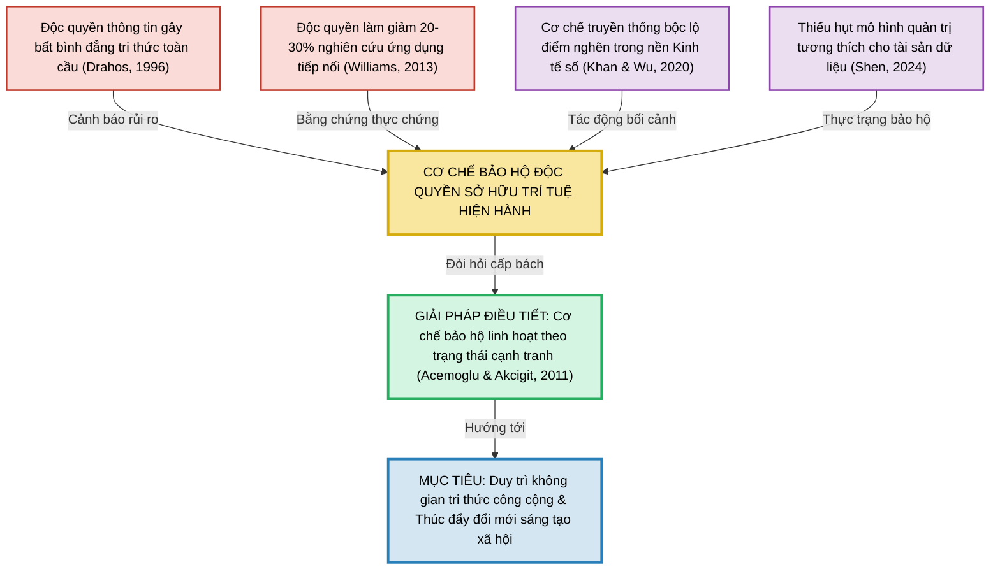

# Sơ đồ: Khung lý thuyết về sự cần thiết phải điều tiết độc quyền Sở hữu trí tuệ

Dưới đây là sơ đồ khái niệm được thiết kế dựa trên đoạn tổng quan tài liệu của bạn. Bạn có thể chụp ảnh màn hình sơ đồ này để đưa trực tiếp vào file Word luận án.

> [!TIP]
> **Hướng dẫn sử dụng:**
>
> - Nếu bạn muốn chỉnh sửa màu sắc, hình dáng hay nội dung chữ, bạn có thể copy đoạn mã chữ bên trong khối trên và dán vào trang web **mermaid.live**. Trang web này sẽ cho phép bạn tinh chỉnh sơ đồ và tải ảnh xuống với chất lượng cao nhất (định dạng PNG hoặc SVG) để dán vào file Word luận án mà không bị mờ chữ.
